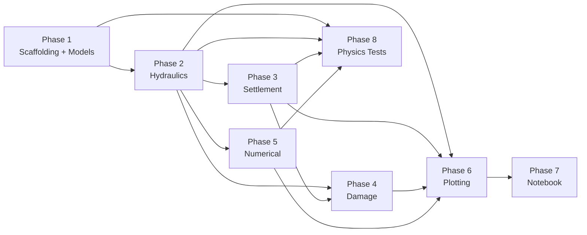

# Ground Settlement During Dewatering — Python Package + Notebook

A Python package (`bronbemaling`) with a Jupyter notebook (`example_analysis.ipynb`) demonstrating its usage. Calculates ground settlement at neighboring buildings caused by dewatering of a residential-scale construction pit.

**Target context**: Flanders, Belgium — residential basement excavation.  
**Language**: English with Dutch terms in parentheses (e.g., "Settlement (zetting)").  
**Package management**: `uv`  

---

## Project Structure

```
d:\repos\bronbemaling\
├── pyproject.toml
├── README.md
├── mkdocs.yml                       # MkDocs configuration (Material theme + mkdocstrings)
├── src/
│   └── bronbemaling/
│       ├── __init__.py              # Package exports + __all__
│       ├── py.typed                 # PEP 561 type stub marker (empty file)
│       ├── models.py                # All dataclasses (input models)
│       ├── hydraulics.py            # Drawdown calculations (Thiem, Theis)
│       ├── settlement.py            # Terzaghi consolidation + settlement
│       ├── damage.py                # Burland/Wroth + SBR classification
│       ├── numerical.py             # 2D finite-difference groundwater solver
│       └── plotting.py              # All 7 visualization functions
├── tests/
│   ├── conftest.py                  # Shared pytest fixtures (profiles, configs)
│   ├── test_models.py               # Dataclass and validation tests
│   ├── test_hydraulics.py           # Drawdown calculation unit tests
│   ├── test_settlement.py           # Consolidation unit tests
│   ├── test_damage.py               # Damage classification unit tests
│   ├── test_numerical.py            # Finite-difference solver unit tests
│   ├── test_plotting.py             # Plot smoke/regression tests
│   └── test_physics_convergence.py  # Limiting-case convergence tests (@slow)
├── docs/
│   ├── index.md                     # Landing page with project overview
│   ├── getting-started.md           # Installation, quick start, build docs
│   └── api/                         # Auto-generated API reference (mkdocstrings)
│       ├── models.md                # Phase 1
│       ├── hydraulics.md            # Phase 2
│       ├── settlement.md            # Phase 3
│       ├── damage.md                # Phase 4
│       ├── numerical.md             # Phase 5
│       └── plotting.md              # Phase 6
└── notebooks/
    └── example_analysis.ipynb       # Full worked example with Flemish defaults
```

---

## Implementation Phases

The implementation is split into **8 phases**, ordered by dependency. Each phase is self-contained: it produces working, tested code that can be reviewed before proceeding to the next phase. Phases 1–5 build the computation core; Phases 6–8 add visualization, integration, and final validation.



| Phase | Name | Source Files | Test Files | Doc Files | Verification Gate |
|---|---|---|---|---|---|
| 1 | **Scaffolding & Data Models** | `pyproject.toml`, `README.md`, `mkdocs.yml`, `__init__.py`, `py.typed`, `models.py` | `conftest.py`, `test_models.py` | `index.md`, `getting-started.md`, `api/models.md` | Tests + doc build pass |
| 2 | **Hydraulics (Drawdown)** | `hydraulics.py` | `test_hydraulics.py` | `api/hydraulics.md` | Tests + doc build pass |
| 3 | **Settlement (Consolidation)** | `settlement.py` | `test_settlement.py` | `api/settlement.md` | Tests + doc build pass |
| 4 | **Damage Assessment** | `damage.py` | `test_damage.py` | `api/damage.md` | Tests + doc build pass |
| 5 | **Numerical Method (FD Solver)** | `numerical.py` | `test_numerical.py` | `api/numerical.md` | Tests + doc build pass |
| 6 | **Visualizations** | `plotting.py` | `test_plotting.py` | `api/plotting.md` | Tests + doc build pass |
| 7 | **Example Notebook** | `notebooks/example_analysis.ipynb` | — | — | All cells execute without errors |
| 8 | **Physics Convergence Tests** | — | `test_physics_convergence.py` | — | `uv run pytest` (full suite) passes |

> [!IMPORTANT]
> **Review protocol**: After each phase, run that phase's verification gate (tests + doc build). Review the code and test results before approving the next phase. The `__init__.py` is created in Phase 1 with only model exports, and is **extended** in each subsequent phase to re-export new public symbols. The `__init__.py` must maintain an explicit `__all__` list.

> [!IMPORTANT]
> **Documentation per phase**: Every phase that introduces a new module must also:
> 1. Write thorough NumPy-style docstrings on all public classes/functions (with units, formulas, parameters)
> 2. Create a `docs/api/<module>.md` page with a `::: bronbemaling.<module>` directive
> 3. Add the new page to the `nav:` section of `mkdocs.yml`
> 4. Update `docs/index.md` navigation links to include the new module
> 5. Verify with `uv run --extra docs mkdocs build` — zero warnings required

> [!TIP]
> **Fast feedback loop**: During development, run `uv run pytest -m 'not slow'` to skip the expensive convergence tests (Phase 8). Run the full suite with `uv run pytest` only after all phases are complete.

---

## Proposed Changes

### Phase 1 — Scaffolding & Data Models

#### [NEW] `pyproject.toml`

```toml
[project]
name = "bronbemaling"
version = "0.1.0"
description = "Ground settlement calculation for dewatering of construction pits"
readme = "README.md"
requires-python = ">=3.11"
dependencies = [
    "numpy>=1.24",
    "scipy>=1.10",
    "matplotlib>=3.7",
    "plotly>=5.15",
]

[project.optional-dependencies]
notebook = ["jupyter>=1.0", "ipykernel>=6.0"]
test = ["pytest>=7.0"]
docs = [
    "mkdocs>=1.5",
    "mkdocs-material>=9.5",
    "mkdocstrings[python]>=0.24",
]

[build-system]
requires = ["hatchling"]
build-backend = "hatchling.build"

[tool.pytest.ini_options]
testpaths = ["tests"]
markers = [
    "slow: marks tests as slow (grid refinement, convergence loops). Deselect with: pytest -m 'not slow'",
]
```

---

#### [NEW] `mkdocs.yml`

```yaml
site_name: Bronbemaling Documentation
site_description: Ground Settlement Calculation During Dewatering of Construction Pits
site_author: Kherim Willems

theme:
  name: material
  palette:
    - scheme: default
      primary: indigo
      accent: indigo
      toggle:
        icon: material/brightness-7
        name: Switch to dark mode
    - scheme: slate
      primary: indigo
      accent: indigo
      toggle:
        icon: material/brightness-4
        name: Switch to light mode
  features:
    - navigation.indexes
    - navigation.top
    - content.code.copy

plugins:
  - search
  - mkdocstrings:
      handlers:
        python:
          options:
            docstring_style: numpy
            show_root_heading: true
            show_source: true

markdown_extensions:
  - pymdownx.highlight:
      anchor_linenums: true
  - pymdownx.inlinehilite
  - pymdownx.snippets
  - pymdownx.superfences
  - pymdownx.arithmatex:
      generic: true

# NOTE: nav is extended in each phase as new API modules are added.
# The version below is the FINAL state after all phases.
nav:
  - Home: index.md
  - Getting Started: getting-started.md
  - API Reference:
      - Models: api/models.md
      - Hydraulics: api/hydraulics.md
      - Settlement: api/settlement.md
      - Damage: api/damage.md
      - Numerical: api/numerical.md
      - Plotting: api/plotting.md
```

> [!NOTE]
> **Phase-by-phase nav evolution**:
> - Phase 1: `nav:` includes Home, Getting Started, API Reference → Models
> - Phase 2: Add Hydraulics to API Reference
> - Phase 3: Add Settlement to API Reference
> - Phase 4: Add Damage to API Reference
> - Phase 5: Add Numerical to API Reference
> - Phase 6: Add Plotting to API Reference

---

#### [NEW] `docs/index.md`

```markdown
# Bronbemaling

**Bronbemaling** is a Python package for calculating ground settlement (zetting)
at neighboring structures caused by dewatering of construction pits.

## Overview

Dewatering (bronbemaling) lowers the groundwater table around a construction
excavation, inducing effective stress changes in underlying soil layers.
In compressible layers (such as clay or peat), this effective stress increase
causes consolidation settlement, which may result in differential settlement
and structural damage to nearby buildings.

This package provides standard Flemish/Dutch geotechnical engineering models for:
- Analytical steady-state (Thiem, Dupuit) and transient (Theis) hydraulic drawdown.
- Multi-well drawdown superposition.
- 1D Terzaghi consolidation and settlement analysis.
- Burland & Wroth / SBR building damage classification.
- 2D finite-difference groundwater solver.
- 7 publication-quality visualizations.

## Navigation

- [Getting Started](getting-started.md): Installation and quick start guide.
- **API Reference**: Complete reference for all modules:
    - [Models](api/models.md) — Input data classes
    - [Hydraulics](api/hydraulics.md) — Drawdown calculations
    - [Settlement](api/settlement.md) — Consolidation engine
    - [Damage](api/damage.md) — Building damage classification
    - [Numerical](api/numerical.md) — Finite-difference solver
    - [Plotting](api/plotting.md) — Visualization functions
```

> [!NOTE]
> The navigation links in `index.md` are extended in each phase to include newly
> created API modules. The version above is the **final** state after all phases.

---

#### [NEW] `docs/getting-started.md`

```markdown
# Getting Started

## Installation

`bronbemaling` uses [`uv`](https://github.com/astral-sh/uv) for fast,
deterministic Python package management.

### Clone and Install

\```bash
git clone <repository-url>
cd bronbemaling

# Install with testing and documentation extras
uv sync --all-extras
\```

### Running Tests

\```bash
uv run pytest -v
\```

### Building Documentation

\```bash
uv run --extra docs mkdocs build
\```

To serve documentation locally:

\```bash
uv run --extra docs mkdocs serve
\```

## Quick Example

\```python
from bronbemaling import (
    SoilProfile,
    SoilLayer,
    DewateringConfig,
    Well,
    AquiferType,
    compute_drawdown_at_points,
)

# 1. Define Soil Profile
profile = SoilProfile(
    surface_level_mtaw=5.0,
    gwl_mtaw=4.0,
    layers=[
        SoilLayer(name="Sand", thickness=2.0, gamma=17.5, gamma_sat=20.0,
                  k_h=1e-4, e0=0.5, Cc=0.02, Cr=0.005, Eoed=30000, Cv=1e-2),
        SoilLayer(name="Clay", thickness=3.0, gamma=16.0, gamma_sat=18.5,
                  k_h=1e-9, e0=1.0, Cc=0.30, Cr=0.06, Eoed=3000, Cv=1e-7, OCR=1.5),
    ]
)

# 2. Configure Dewatering System
wells = [Well(x=0.0, y=0.0, Q=0.001)]
config = DewateringConfig(
    wells=wells,
    target_drawdown_mtaw=1.5,
    original_gwl_mtaw=4.0,
    pumping_duration_days=90,
    aquifer_type=AquiferType.UNCONFINED,
)

# 3. Compute Drawdown at (x=10, y=0)
drawdown = compute_drawdown_at_points([(10.0, 0.0)], config, profile)
print(f"Drawdown at 10m distance: {drawdown[0]:.3f} m")
\```
```

---

#### [NEW] `docs/api/*.md` (per-module API pages)

Each API doc page follows the same pattern — a heading plus a single mkdocstrings directive:

```markdown
# <Module Name> API Reference

::: bronbemaling.<module_name>
```

**Pages created per phase:**

| Phase | File | Heading | Directive |
|---|---|---|---|
| 1 | `docs/api/models.md` | `# Data Models API Reference` | `::: bronbemaling.models` |
| 2 | `docs/api/hydraulics.md` | `# Hydraulics API Reference` | `::: bronbemaling.hydraulics` |
| 3 | `docs/api/settlement.md` | `# Settlement API Reference` | `::: bronbemaling.settlement` |
| 4 | `docs/api/damage.md` | `# Damage Assessment API Reference` | `::: bronbemaling.damage` |
| 5 | `docs/api/numerical.md` | `# Numerical Solver API Reference` | `::: bronbemaling.numerical` |
| 6 | `docs/api/plotting.md` | `# Plotting API Reference` | `::: bronbemaling.plotting` |

---

#### [NEW] `src/bronbemaling/py.typed`

Empty file (PEP 561 marker). Signals to type checkers that this package ships inline type annotations.

---

#### [NEW] `src/bronbemaling/models.py`

All input data structures as frozen dataclasses. Every field has a type annotation, unit in the docstring, and a sensible default where appropriate.

```python
from dataclasses import dataclass, field
from enum import Enum
from typing import Optional


class AquiferType(Enum):
    """Type of aquifer for hydraulic calculations."""

    CONFINED = "confined"  # Afgesloten watervoerend pakket
    UNCONFINED = "unconfined"  # Freatisch watervoerend pakket


class BuildingType(Enum):
    """Building construction type for damage classification."""

    MASONRY = "masonry"  # Metselwerk
    CONCRETE_FRAME = "concrete_frame"  # Betonskelet


@dataclass
class SoilLayer:
    """A single soil layer with geotechnical properties.

    All properties in SI units. Each layer is horizontal and uniform.
    """

    name: str  # e.g., "Klei" or "Zand"
    thickness: float  # [m] Layer thickness
    gamma: float  # [kN/m³] Dry unit weight
    gamma_sat: float  # [kN/m³] Saturated unit weight
    k_h: float  # [m/s] Horizontal hydraulic conductivity
    e0: float  # [-] Initial void ratio
    Cc: float  # [-] Compression index (virgin compression)
    Cr: float  # [-] Recompression index (swelling/recompression)
    Eoed: float  # [kPa] Oedometric (constrained) modulus
    Cv: float  # [m²/s] Coefficient of consolidation
    OCR: float = 1.0  # [-] Overconsolidation ratio


@dataclass
class SoilProfile:
    """Multi-layer soil profile with groundwater level.

    Layers are ordered top-to-bottom. The first layer starts at ground surface (z=0).
    """

    layers: list[SoilLayer]
    gwl_mtaw: float  # [mTAW] Groundwater level in Belgian datum (Tweede Algemene Waterpassing)
    surface_level_mtaw: float  # [mTAW] Ground surface level in Belgian datum

    @property
    def gwl_depth(self) -> float:
        """[m] Depth of groundwater below surface (positive downward)."""
        return self.surface_level_mtaw - self.gwl_mtaw

    @property
    def total_depth(self) -> float:
        """[m] Total depth of all layers combined."""
        return sum(layer.thickness for layer in self.layers)


@dataclass
class Well:
    """A single dewatering well."""

    x: float  # [m] X-coordinate in local system
    y: float  # [m] Y-coordinate in local system
    Q: float  # [m³/s] Pumping rate (positive = extraction)
    r_w: float = 0.075  # [m] Well radius (default 150mm diameter)
    screen_top_mtaw: float = 0.0  # [mTAW] Top of well screen
    screen_bottom_mtaw: float = 0.0  # [mTAW] Bottom of well screen


@dataclass
class ConstructionPit:
    """Rectangular construction pit geometry."""

    length: float  # [m] Pit length (x-direction)
    width: float  # [m] Pit width (y-direction)
    depth: float  # [m] Pit depth below surface
    center_x: float = 0.0  # [m] X-coordinate of pit center
    center_y: float = 0.0  # [m] Y-coordinate of pit center
    bottom_mtaw: float = 0.0  # [mTAW] Pit bottom level


@dataclass
class DewateringConfig:
    """Dewatering well configuration and hydraulic parameters."""

    wells: list[Well]
    target_drawdown_mtaw: float  # [mTAW] Target water level inside the pit
    original_gwl_mtaw: float  # [mTAW] Original (undisturbed) groundwater level
    pumping_duration_days: float  # [days] Duration of pumping
    aquifer_type: AquiferType = AquiferType.UNCONFINED
    R: Optional[float] = None  # [m] Radius of influence (computed via Sichardt if None)
    T: Optional[float] = None  # [m²/s] Transmissivity (computed from layers if None)
    S: Optional[float] = None  # [-] Storativity (computed from layers if None)

    @property
    def target_drawdown(self) -> float:
        """[m] Total drawdown from original GWL to target level."""
        return self.original_gwl_mtaw - self.target_drawdown_mtaw


@dataclass
class Building:
    """Neighboring building to assess for settlement damage."""

    x: float  # [m] X-coordinate of building center
    y: float  # [m] Y-coordinate of building center
    length: float  # [m] Building length
    width: float  # [m] Building width
    orientation_deg: float = 0.0  # [°] Rotation angle from x-axis
    foundation_depth: float = 0.6  # [m] Foundation depth below surface
    building_type: BuildingType = BuildingType.MASONRY

    def corner_coordinates(self) -> list[tuple[float, float]]:
        """Return (x, y) coordinates of the 4 building corners, accounting for orientation.

        Implementation:
        1. Define corners relative to center: (±length/2, ±width/2)
        2. Apply 2D rotation matrix using orientation_deg
        3. Translate to (self.x, self.y)

        Returns list of 4 tuples: [bottom-left, bottom-right, top-right, top-left]
        """
        ...

    def evaluation_points(self) -> list[tuple[float, float]]:
        """Return 5 evaluation points: 4 corners + center.

        Returns list of 5 tuples: [center, corner1, corner2, corner3, corner4]
        """
        ...
```

> [!IMPORTANT]
> **mTAW (Tweede Algemene Waterpassing)**: All absolute water levels and elevations use the Belgian national reference datum mTAW. Relative measurements (layer thicknesses, drawdown magnitudes) remain in meters. The `SoilProfile` provides a `gwl_depth` property that converts from mTAW to depth below surface for internal calculations.

---

### Phase 2 — Hydraulics (Drawdown)

#### [NEW] `src/bronbemaling/hydraulics.py`

Drawdown computation via analytical solutions with well superposition.

```python
"""Hydraulic drawdown calculations for dewatering.

Supports both confined and unconfined aquifers, steady-state (Thiem/Dupuit)
and transient (Theis) solutions, with superposition for multiple wells.
"""

import numpy as np
from scipy.special import exp1
from .models import DewateringConfig, SoilProfile, AquiferType

GAMMA_W = 9.81  # [kN/m³] Unit weight of water


def compute_transmissivity(profile: SoilProfile, config: DewateringConfig) -> float:
    """Compute aquifer transmissivity T [m²/s] from soil layers.

    For UNCONFINED: T = sum(k_h_i * thickness_i) for all saturated layers above the aquifer base.
    For CONFINED: T = sum(k_h_i * thickness_i) for layers within the confined aquifer only
                  (layers below the confining clay layer).

    The confining layer is identified as the layer with the lowest k_h value.
    """
    ...


def compute_storativity(profile: SoilProfile, config: DewateringConfig) -> float:
    """Compute storativity S [-] from soil layers.

    For UNCONFINED: S = specific yield ≈ effective porosity ≈ e0 / (1 + e0) for the
                    aquifer layer (typically 0.1 – 0.3 for sand).
    For CONFINED: S = sum(m_v_i * gamma_w * thickness_i) where m_v = 1/Eoed
                  (typically 1e-4 to 1e-3).
    """
    ...


def compute_radius_of_influence(config: DewateringConfig, T: float) -> float:
    """Compute radius of influence R [m] using Sichardt's empirical formula.

    R = 3000 * s * sqrt(k)

    where:
        s = target_drawdown [m]
        k = representative hydraulic conductivity [m/s] (derived from T / aquifer_thickness)

    Typical values: 50–500m for sand, 10–50m for silty sand.
    Returns config.R if explicitly set, otherwise computes it.
    """
    ...


def thiem_drawdown_single_well(
    r: float | np.ndarray,
    Q: float,
    T: float,
    R: float,
    H0: float,
    aquifer_type: AquiferType,
) -> float | np.ndarray:
    """Steady-state drawdown at distance r from a single well.

    CONFINED (Thiem, 1906):
        s(r) = Q / (2π T) * ln(R / r)

    UNCONFINED (Dupuit, 1863):
        h²(r) = H0² - (Q / (π K)) * ln(R / r)
        s(r) = H0 - h(r)
        where H0 = initial saturated thickness, K = hydraulic conductivity

    Parameters:
        r: distance(s) from well [m]. Clipped to r_w minimum.
        Q: pumping rate [m³/s]
        T: transmissivity [m²/s]
        R: radius of influence [m]
        H0: initial saturated aquifer thickness [m]
        aquifer_type: CONFINED or UNCONFINED

    Returns:
        drawdown s [m] at distance r (always >= 0, clipped)
    """
    ...


def theis_drawdown_single_well(
    r: float | np.ndarray,
    t: float,
    Q: float,
    T: float,
    S: float,
) -> float | np.ndarray:
    """Transient drawdown at distance r and time t from a single well (Theis, 1935).

    s(r, t) = Q / (4π T) * W(u)

    where:
        u = r² S / (4 T t)
        W(u) = -Ei(-u) = exp1(u) from scipy (the Theis well function)

    For u < 1e-5 (large t or small r), use the Cooper-Jacob approximation:
        s ≈ Q / (4π T) * [ln(2.25 T t / (r² S))]

    Parameters:
        r: distance from well [m]
        t: time since pumping started [s]
        Q: pumping rate [m³/s]
        T: transmissivity [m²/s]
        S: storativity [-]

    Returns:
        drawdown s [m]
    """
    ...


def compute_drawdown_at_points(
    points: list[tuple[float, float]],
    config: DewateringConfig,
    profile: SoilProfile,
    time_s: float | None = None,
) -> np.ndarray:
    """Compute total drawdown at multiple (x,y) points using superposition.

    Algorithm:
    1. Compute T (transmissivity) from profile, or use config.T if set
    2. Compute R (radius of influence) from config, or via Sichardt
    3. For each point (x, y):
       a. For each well in config.wells:
          - Compute distance r = sqrt((x - well.x)² + (y - well.y)²)
          - Clip r to max(r, well.r_w) to avoid singularity
          - If time_s is None: use thiem_drawdown_single_well()
          - If time_s is given: use theis_drawdown_single_well()
       b. Sum drawdowns from all wells (superposition principle)
       c. Clip total drawdown to [0, config.target_drawdown] (physical limit)
    4. Return array of drawdowns, shape (len(points),)

    Parameters:
        points: list of (x, y) coordinates [m]
        config: dewatering configuration
        profile: soil profile (for computing T, S if not in config)
        time_s: time since pumping start [s]. None = steady-state (Thiem).

    Returns:
        np.ndarray of drawdown values [m] at each point
    """
    ...


def compute_drawdown_grid(
    x_range: tuple[float, float],
    y_range: tuple[float, float],
    nx: int,
    ny: int,
    config: DewateringConfig,
    profile: SoilProfile,
    time_s: float | None = None,
) -> tuple[np.ndarray, np.ndarray, np.ndarray]:
    """Compute drawdown on a regular 2D grid for contour plotting.

    Creates meshgrid from x_range and y_range, calls compute_drawdown_at_points
    for each grid node.

    Returns:
        (X, Y, S) where X, Y are meshgrid arrays and S is drawdown array,
        all shape (ny, nx).
    """
    ...
```

---

### Phase 3 — Settlement (Consolidation)

#### [NEW] `src/bronbemaling/settlement.py`

Core settlement engine — layer-by-layer Terzaghi consolidation.

```python
"""Settlement calculation using Terzaghi 1D consolidation theory.

Computes effective stress changes from drawdown, then settlement per layer
using Cc/Cr (log-law) or Eoed (linear) approach.
"""

import numpy as np
from .models import SoilProfile, SoilLayer

GAMMA_W = 9.81  # [kN/m³]


def compute_initial_stress_profile(
    profile: SoilProfile,
    z_points: np.ndarray | None = None,
) -> tuple[np.ndarray, np.ndarray, np.ndarray]:
    """Compute initial vertical effective stress profile with depth.

    Algorithm (layer by layer, top to bottom):
    1. Start at z=0 (ground surface), σ_v = 0, u = 0
    2. For each layer, at depth increments:
       a. Above GWL: σ_v += γ_dry * Δz,  u = 0
       b. Below GWL: σ_v += γ_sat * Δz,  u += γ_w * Δz
       c. σ'_v = σ_v - u
    3. Compute at layer midpoints if z_points is None,
       otherwise interpolate to requested z_points

    Parameters:
        profile: soil profile
        z_points: optional specific depths to evaluate [m], measured from surface

    Returns:
        (z, sigma_v_eff, sigma_v_total):
            z: depth array [m]
            sigma_v_eff: effective vertical stress [kPa]
            sigma_v_total: total vertical stress [kPa]
    """
    ...


def compute_stress_increase_from_drawdown(
    profile: SoilProfile,
    drawdown: float,
    z_points: np.ndarray | None = None,
) -> tuple[np.ndarray, np.ndarray]:
    """Compute increase in effective stress due to drawdown at each depth.

    The drawdown lowers the water table, converting submerged soil to dry soil,
    which increases effective stress.

    Algorithm:
    1. Original GWL depth = profile.gwl_depth
    2. New GWL depth = profile.gwl_depth + drawdown
    3. For each depth z:
       a. If z < original_gwl_depth: Δσ' = 0 (above original water table, no change)
       b. If original_gwl_depth <= z < new_gwl_depth: Δσ' = (γ_sat - γ_dry) * (z - original_gwl_depth)
          Wait, this is not quite right. Actually:
          Δσ' = γ_w * drawdown for z >= new_gwl_depth (full drawdown effect)
          For original_gwl_depth <= z < new_gwl_depth: Δσ' = γ_w * (z - original_gwl_depth)
          (partial drawdown, linear increase)
       c. If z >= new_gwl_depth: Δσ' = γ_w * drawdown (full drawdown effect)

    More precisely, the change in pore water pressure is:
       Δu = -γ_w * min(drawdown, max(0, z - original_gwl_depth))
       (but capped: the pore pressure can't go below zero)
    So: Δσ' = -Δu = γ_w * min(drawdown, max(0, z - original_gwl_depth))

    Parameters:
        profile: soil profile
        drawdown: drawdown at this location [m]
        z_points: depths to evaluate at [m]

    Returns:
        (z, delta_sigma_eff): arrays of depth and effective stress increase [kPa]
    """
    ...


def compute_layer_settlement_cc_cr(
    layer: SoilLayer,
    sigma_v0_eff: float,
    delta_sigma_v: float,
) -> float:
    """Compute settlement of a single layer using Cc/Cr approach.

    Preconsolidation pressure: σ'_p = OCR * σ'_v0

    Case 1 — Fully overconsolidated (σ'_v0 + Δσ'_v ≤ σ'_p):
        Δs = (Cr / (1 + e0)) * H * log10((σ'_v0 + Δσ'_v) / σ'_v0)

    Case 2 — Fully normally consolidated (σ'_v0 ≥ σ'_p, i.e., OCR ≈ 1):
        Δs = (Cc / (1 + e0)) * H * log10((σ'_v0 + Δσ'_v) / σ'_v0)

    Case 3 — Transitional (σ'_v0 < σ'_p < σ'_v0 + Δσ'_v):
        Δs = (Cr / (1 + e0)) * H * log10(σ'_p / σ'_v0)
           + (Cc / (1 + e0)) * H * log10((σ'_v0 + Δσ'_v) / σ'_p)

    Parameters:
        layer: soil layer properties
        sigma_v0_eff: initial effective vertical stress at layer midpoint [kPa]
        delta_sigma_v: increase in effective vertical stress [kPa]

    Returns:
        settlement of this layer [m]
    """
    ...


def compute_layer_settlement_eoed(
    layer: SoilLayer,
    delta_sigma_v: float,
) -> float:
    """Compute settlement of a single layer using constrained modulus.

    Δs = (Δσ'_v / Eoed) * H

    Parameters:
        layer: soil layer properties (uses layer.Eoed and layer.thickness)
        delta_sigma_v: increase in effective vertical stress [kPa]

    Returns:
        settlement of this layer [m]
    """
    ...


def compute_total_settlement(
    profile: SoilProfile,
    drawdown: float,
    method: str = "cc_cr",
) -> tuple[float, list[float]]:
    """Compute total settlement by summing contributions from all layers.

    Algorithm:
    1. Compute initial effective stress at each layer midpoint:
       z_mid_i = sum(thickness of layers above) + thickness_i / 2
       σ'_v0_i = compute_initial_stress_profile() evaluated at z_mid_i
    2. Compute effective stress increase at each layer midpoint:
       Δσ'_v_i = compute_stress_increase_from_drawdown() evaluated at z_mid_i
    3. For each layer, if Δσ'_v_i > 0:
       - If method == "cc_cr": Δs_i = compute_layer_settlement_cc_cr(layer_i, σ'_v0_i, Δσ'_v_i)
       - If method == "eoed": Δs_i = compute_layer_settlement_eoed(layer_i, Δσ'_v_i)
    4. Total: s_total = sum(Δs_i for all layers)

    Parameters:
        profile: soil profile
        drawdown: drawdown at this location [m]
        method: "cc_cr" or "eoed"

    Returns:
        (total_settlement [m], list of per-layer settlements [m])
    """
    ...


def compute_degree_of_consolidation(Tv: float) -> float:
    """Compute degree of consolidation U(Tv) using Terzaghi's closed-form approximations.

    For Tv ≤ 0.2827 (U < 60%):
        U = sqrt(4 * Tv / π)

    For Tv > 0.2827 (U ≥ 60%):
        U = 1 - (8 / π²) * exp(-π² * Tv / 4)

    Parameters:
        Tv: time factor [-] = Cv * t / Hdr²

    Returns:
        U: degree of consolidation, 0 to 1
    """
    ...


def compute_settlement_vs_time(
    profile: SoilProfile,
    drawdown: float,
    times_days: np.ndarray,
    method: str = "cc_cr",
) -> np.ndarray:
    """Compute settlement as a function of time (consolidation).

    Algorithm:
    1. Compute ultimate settlement s_ult = compute_total_settlement()
    2. Find the compressible (clay) layers — those with Cv > 0 and Cc > 0
    3. For each clay layer:
       a. Determine drainage path Hdr:
          - If bounded by sand layers on both sides: Hdr = thickness / 2 (double drainage)
          - If bounded by sand on one side only: Hdr = thickness (single drainage)
       b. For each time t in times_days:
          - Tv = Cv * t_seconds / Hdr²
          - U(t) = compute_degree_of_consolidation(Tv)
       c. Layer settlement at time t: s_i(t) = U(t) * s_i_ult
    4. For non-clay layers (sand, fill): assume immediate settlement (U = 1 for all t)
    5. Total: s(t) = sum of s_i(t) for all layers

    Parameters:
        profile: soil profile
        drawdown: drawdown at location [m]
        times_days: array of times [days]
        method: "cc_cr" or "eoed"

    Returns:
        np.ndarray of settlement values [m] at each time step
    """
    ...
```

---

### Phase 4 — Damage Assessment

#### [NEW] `src/bronbemaling/damage.py`

Building damage classification per Burland & Wroth (1974) and SBR.

```python
"""Building damage assessment using Burland & Wroth and SBR classification.

Computes differential settlement, angular distortion, and classifies damage
risk for neighboring buildings.
"""

from dataclasses import dataclass
from .models import Building, SoilProfile, DewateringConfig, BuildingType


@dataclass
class DamageAssessment:
    """Results of the building damage assessment."""

    settlement_at_points: dict[str, float]
    # Keys: "center", "corner_1"..."corner_4", values: settlement [m]

    max_settlement: float  # [m]
    min_settlement: float  # [m]
    differential_settlement: float  # [m] max - min
    angular_distortion: float  # [-] β = Δs / L (dimensionless)
    deflection_ratio: float  # [-] Δ/L

    damage_category: int  # 0–5 (SBR/Burland)
    damage_description: str  # e.g., "Slight (Licht)"
    expected_crack_width: str  # e.g., "1 – 5 mm"
    risk_color: str  # Color code for visualization: "green", "yellow", "orange", "red", "darkred", "black"


# SBR damage classification thresholds
# Based on Burland & Wroth (1974), adapted for Dutch/Flemish practice
SBR_THRESHOLDS = [
    # (max_angular_distortion, category, description_en, description_nl, crack_width, color)
    (1 / 500, 0, "Negligible", "Verwaarloosbaar", "< 0.1 mm", "green"),
    (1 / 333, 1, "Very slight", "Zeer licht", "0.1 – 1 mm", "yellow"),
    (1 / 250, 2, "Slight", "Licht", "1 – 5 mm", "orange"),
    (1 / 150, 3, "Moderate", "Matig", "5 – 15 mm", "red"),
    (1 / 75, 4, "Severe", "Ernstig", "15 – 25 mm", "darkred"),
    (float("inf"), 5, "Very severe", "Zeer ernstig", "> 25 mm", "black"),
]


def classify_damage(
    angular_distortion: float, building_type: BuildingType
) -> tuple[int, str, str, str]:
    """Classify damage category from angular distortion.

    Algorithm:
    1. Iterate through SBR_THRESHOLDS
    2. Return the first category where angular_distortion < threshold
    3. For CONCRETE_FRAME buildings, shift thresholds by +1 category
       (concrete frames tolerate more distortion than masonry)

    Returns:
        (category, description, crack_width, color)
    """
    ...


def assess_building_damage(
    building: Building,
    profile: SoilProfile,
    config: DewateringConfig,
    drawdown_func,  # callable(points) -> np.ndarray of drawdowns
    settlement_method: str = "cc_cr",
) -> DamageAssessment:
    """Full damage assessment for a building.

    Algorithm:
    1. Get evaluation points from building.evaluation_points() → 5 points
    2. Compute drawdown at each point using drawdown_func(points)
    3. Compute settlement at each point using compute_total_settlement(profile, drawdown_i)
    4. Find max and min settlement among the 5 points
    5. Compute differential settlement Δs = max - min
    6. Compute angular distortion β:
       - Find the two points with max settlement difference
       - β = |s1 - s2| / distance(point1, point2)
    7. Compute deflection ratio Δ/L:
       - Δ = max settlement - average of edge settlements
       - L = building diagonal length
    8. Classify damage using classify_damage(β, building.building_type)
    9. Return DamageAssessment
    """
    ...
```

---

### Phase 5 — Numerical Method (Finite-Difference Solver)

#### [NEW] `src/bronbemaling/numerical.py`

2D finite-difference groundwater flow solver — pure NumPy/SciPy.

```python
"""2D finite-difference groundwater flow solver.

Solves the steady-state Laplace equation ∇²h = 0 (or with source terms for wells)
on a regular grid, then feeds the resulting drawdown field into the settlement engine.
"""

import numpy as np
from scipy import sparse
from scipy.sparse.linalg import spsolve
from .models import DewateringConfig, SoilProfile, ConstructionPit


@dataclass
class FDGrid:
    """Finite-difference grid definition."""

    x: np.ndarray  # 1D array of x-coordinates [m]
    y: np.ndarray  # 1D array of y-coordinates [m]
    dx: float  # Grid spacing in x [m]
    dy: float  # Grid spacing in y [m]
    nx: int  # Number of nodes in x
    ny: int  # Number of nodes in y
    head: np.ndarray  # 2D array of hydraulic head [m], shape (ny, nx)


def create_grid(
    x_range: tuple[float, float],
    y_range: tuple[float, float],
    dx: float = 1.0,
) -> FDGrid:
    """Create a regular finite-difference grid.

    Parameters:
        x_range, y_range: (min, max) extents [m]
        dx: grid spacing [m] (same for x and y)

    Returns:
        FDGrid with head initialized to 0
    """
    ...


def solve_steady_state(
    grid: FDGrid,
    config: DewateringConfig,
    profile: SoilProfile,
    pit: ConstructionPit,
) -> FDGrid:
    """Solve steady-state groundwater flow equation on the grid.

    Governing equation (2D, confined, homogeneous):
        T * (∂²h/∂x² + ∂²h/∂y²) = -Q_well * δ(x_w, y_w)

    Discretized (5-point stencil):
        T * (h[i-1,j] + h[i+1,j] + h[i,j-1] + h[i,j+1] - 4*h[i,j]) / dx² = -Q_w / (dx*dy)

    Algorithm:
    1. Build the coefficient matrix A as a sparse (CSR) matrix:
       - Interior nodes: 5-point Laplacian stencil, coefficient = T/dx²
       - Boundary nodes: Dirichlet BC, h = H0 (undisturbed head)
       - Well nodes: add source term Q_w / (dx*dy) to RHS vector b
    2. Assemble RHS vector b (zero everywhere except at well nodes and boundaries)
    3. Solve A * h_flat = b using scipy.sparse.linalg.spsolve
    4. Reshape h_flat to 2D grid
    5. Compute drawdown: s = H0 - h

    The matrix A has size (nx*ny) × (nx*ny). Node (i,j) maps to index i*nx + j.

    Parameters:
        grid: FD grid (modified in place, head field updated)
        config: dewatering config (wells, etc.)
        profile: soil profile (for T computation)
        pit: construction pit geometry (for identifying pit area nodes)

    Returns:
        Updated FDGrid with solved head field
    """
    ...


def extract_drawdown_at_points(
    grid: FDGrid,
    points: list[tuple[float, float]],
    H0: float,
) -> np.ndarray:
    """Extract drawdown values at arbitrary points from the grid using bilinear interpolation.

    Algorithm:
    1. For each point (x, y):
       a. Find the enclosing grid cell: i, j such that grid.x[j] <= x < grid.x[j+1]
       b. Bilinear interpolation of grid.head at (x, y)
       c. drawdown = H0 - interpolated_head
    2. Use scipy.interpolate.RegularGridInterpolator for efficiency

    Returns:
        np.ndarray of drawdown values [m]
    """
    ...
```

---

### Phase 6 — Visualizations

#### [NEW] `src/bronbemaling/plotting.py`

All 7 visualizations. Each is a standalone function returning a `matplotlib.figure.Figure` or `plotly.graph_objects.Figure`.

```python
"""Visualization functions for dewatering settlement analysis.

All functions return Figure objects (matplotlib or plotly) — they do NOT call plt.show().
The notebook calls fig.show() or display(fig) explicitly.
"""

import numpy as np
import matplotlib.pyplot as plt
import matplotlib.patches as mpatches
from matplotlib.colors import LinearSegmentedColormap
import plotly.graph_objects as go
from .models import SoilProfile, ConstructionPit, DewateringConfig, Building
from .damage import DamageAssessment


def plot_cross_section(
    profile: SoilProfile,
    pit: ConstructionPit,
    config: DewateringConfig,
    building: Building,
    drawdown_at_building: float,
) -> plt.Figure:
    """Cross-section showing soil layers, water tables, pit, and building foundation.

    Layout (x-axis = horizontal distance, y-axis = depth/elevation):
    1. Draw each soil layer as a colored horizontal band (use distinct colors per soil type):
       - Fill: light brown (#D2B48C)
       - Sand (Zand): yellow (#F4D03F)
       - Clay (Klei): green-gray (#8FBC8F)
       - Peat (Veen): dark brown (#654321)
    2. Draw original GWL as a blue dashed line across the full width
    3. Draw lowered GWL as a blue solid line, following the drawdown cone shape
       (use drawdown computed at multiple x-positions along the section)
    4. Draw the construction pit as a white rectangle with black outline
    5. Draw the building as a gray rectangle at its distance from the pit
    6. Draw the building foundation as a thick black line at foundation_depth
    7. Add mTAW elevation labels on the right y-axis
    8. Hatch the drawdown zone (between original and lowered GWL) with blue diagonal lines

    Figure size: (14, 8) inches. Include legend and title.
    """
    ...


def plot_plan_view(
    pit: ConstructionPit,
    config: DewateringConfig,
    building: Building,
    X_grid: np.ndarray,
    Y_grid: np.ndarray,
    drawdown_grid: np.ndarray,
    assessment: DamageAssessment,
) -> plt.Figure:
    """Plan view with pit, wells, drawdown contours, and building.

    Layout:
    1. Filled contour plot of drawdown_grid using a blue colormap (light=small, dark=large)
    2. Contour lines with labels (drawdown in meters)
    3. Pit outline as a thick black rectangle
    4. Well positions as red circles with 'W' labels
    5. Building footprint as a colored rectangle:
       - Color = damage assessment risk_color
       - Annotate corners with settlement values in mm
    6. North arrow and scale bar
    7. Colorbar with label "Verlaging (Drawdown) [m]"

    Figure size: (12, 10) inches.
    """
    ...


def plot_settlement_trough(
    profile: SoilProfile,
    config: DewateringConfig,
    pit: ConstructionPit,
    building: Building,
    x_transect: np.ndarray,
    settlements: np.ndarray,
) -> plt.Figure:
    """Settlement profile along a transect from pit center through the building.

    Layout:
    1. x-axis: horizontal distance [m] from pit center
    2. y-axis: settlement [mm] (positive downward, so invert y-axis)
    3. Plot settlement curve as a solid line with markers
    4. Shade the building footprint zone with a light gray vertical band
    5. Mark the pit extent with a dark gray vertical band
    6. Add horizontal dashed lines for SBR damage thresholds (color-coded)
    7. Annotate max settlement at building location

    Figure size: (14, 6) inches.
    """
    ...


def plot_time_settlement(
    times_days: np.ndarray,
    settlements_at_corners: dict[str, np.ndarray],
    pumping_duration_days: float,
) -> plt.Figure:
    """Time-settlement curve showing consolidation over time.

    Layout:
    1. x-axis: time [days], log scale optional
    2. y-axis: settlement [mm] (positive downward, inverted)
    3. Plot s(t) curves for each building evaluation point (different line styles)
    4. Vertical dashed line at pumping_duration_days with label
    5. Add secondary y-axis showing degree of consolidation U [%]
    6. Legend identifying each evaluation point

    Figure size: (12, 6) inches.
    """
    ...


def plot_effective_stress_profile(
    profile: SoilProfile,
    z: np.ndarray,
    sigma_eff_initial: np.ndarray,
    sigma_eff_final: np.ndarray,
) -> plt.Figure:
    """Effective stress profile with depth, before and after drawdown.

    Layout:
    1. x-axis: effective stress σ'_v [kPa]
    2. y-axis: depth [m] (positive downward, inverted)
    3. Plot initial σ'_v as blue line, final σ'_v as red line
    4. Shade the area between them (the stress increase) in light red
    5. Draw horizontal lines at layer boundaries with layer names
    6. Draw GWL marker (original and lowered)
    7. Legend: "Initial (Initieel)" and "After drawdown (Na verlaging)"

    Figure size: (8, 10) inches.
    """
    ...


def plot_3d_drawdown(
    X_grid: np.ndarray,
    Y_grid: np.ndarray,
    drawdown_grid: np.ndarray,
    pit: ConstructionPit,
    building: Building,
) -> go.Figure:
    """Interactive 3D surface plot of the drawdown field using plotly.

    Layout:
    1. Surface plot of drawdown (z-axis inverted so drawdown goes down)
    2. Colorscale: blues (light = small drawdown, dark = large)
    3. Add pit outline as a 3D line trace at the drawdown surface
    4. Add building footprint as a 3D line trace
    5. Axis labels: "X [m]", "Y [m]", "Verlaging (Drawdown) [m]"
    6. Camera angle: isometric view, adjustable by user
    7. Hover tooltip showing (x, y, drawdown) values

    Returns plotly Figure object.
    """
    ...


def plot_damage_summary(
    assessment: DamageAssessment,
) -> plt.Figure:
    """Damage classification summary as a styled table figure.

    Layout:
    1. Create a matplotlib table (plt.table) with columns:
       Parameter | Value | Unit | Threshold | Status
    2. Rows:
       - Max settlement | {value} | mm | — | —
       - Min settlement | {value} | mm | — | —
       - Differential settlement | {value} | mm | — | —
       - Angular distortion β | 1/{1/value} | — | 1/500 | ✓/✗
       - Deflection ratio Δ/L | {value} | — | — | —
       - Damage category | {cat} | — | — | {description}
       - Expected crack width | {width} | mm | — | —
    3. Color the "Damage category" row background with assessment.risk_color
    4. Bold the category description
    5. Title: "Building Damage Assessment (Schade-beoordeling)"

    Figure size: (10, 4) inches.
    """
    ...
```

---

#### [NEW] `src/bronbemaling/__init__.py`

> [!NOTE]
> Created in Phase 1 with model-only exports. **Extended** in each subsequent phase to re-export that phase's public API. The version shown below is the final state after all phases. Must maintain an explicit `__all__` list for mkdocstrings and IDE support.

```python
"""Bronbemaling — Ground settlement calculation for dewatering of construction pits.

Berekening van grondverzakking door bronbemaling bij bouwputten.
"""

from .models import (
    SoilLayer,
    SoilProfile,
    Well,
    ConstructionPit,
    DewateringConfig,
    Building,
    AquiferType,
    BuildingType,
)
from .hydraulics import (
    compute_drawdown_at_points,
    compute_drawdown_grid,
    compute_transmissivity,
    compute_storativity,
    compute_radius_of_influence,
    thiem_drawdown_single_well,
    theis_drawdown_single_well,
)
from .settlement import (
    compute_initial_stress_profile,
    compute_stress_increase_from_drawdown,
    compute_layer_settlement_cc_cr,
    compute_layer_settlement_eoed,
    compute_total_settlement,
    compute_degree_of_consolidation,
    compute_settlement_vs_time,
)
from .damage import assess_building_damage, classify_damage, DamageAssessment
from .numerical import create_grid, solve_steady_state, extract_drawdown_at_points

__version__ = "0.1.0"

__all__ = [
    # models
    "SoilLayer",
    "SoilProfile",
    "Well",
    "ConstructionPit",
    "DewateringConfig",
    "Building",
    "AquiferType",
    "BuildingType",
    # hydraulics
    "compute_drawdown_at_points",
    "compute_drawdown_grid",
    "compute_transmissivity",
    "compute_storativity",
    "compute_radius_of_influence",
    "thiem_drawdown_single_well",
    "theis_drawdown_single_well",
    # settlement
    "compute_initial_stress_profile",
    "compute_stress_increase_from_drawdown",
    "compute_layer_settlement_cc_cr",
    "compute_layer_settlement_eoed",
    "compute_total_settlement",
    "compute_degree_of_consolidation",
    "compute_settlement_vs_time",
    # damage
    "assess_building_damage",
    "classify_damage",
    "DamageAssessment",
    # numerical
    "create_grid",
    "solve_steady_state",
    "extract_drawdown_at_points",
    # meta
    "__version__",
]
```

---

### Phase 7 — Example Notebook

#### [NEW] `notebooks/example_analysis.ipynb`

A complete worked example notebook with the following cell structure:

**Cell 1 — Markdown**: Title, description, author, date  
**Cell 2 — Code**: Imports (`from bronbemaling import *`, numpy, matplotlib, plotly)  
**Cell 3 — Markdown**: "§1 Input Parameters (Invoergegevens)"  
**Cell 4 — Code**: Define the default Flemish scenario:

```python
# === Soil Profile (Grondopbouw) ===
profile = SoilProfile(
    surface_level_mtaw=5.0,  # mTAW
    gwl_mtaw=4.0,  # mTAW (1m below surface)
    layers=[
        SoilLayer(
            "Aanvulling (Fill)",
            thickness=0.5,
            gamma=17.0,
            gamma_sat=19.0,
            k_h=1e-5,
            e0=0.6,
            Cc=0.05,
            Cr=0.01,
            Eoed=15000,
            Cv=1e-4,
            OCR=3.0,
        ),
        SoilLayer(
            "Zand (Sand)",
            thickness=2.0,
            gamma=17.5,
            gamma_sat=20.0,
            k_h=1e-4,
            e0=0.5,
            Cc=0.02,
            Cr=0.005,
            Eoed=30000,
            Cv=1e-2,
            OCR=1.5,
        ),
        SoilLayer(
            "Klei (Clay)",
            thickness=3.0,
            gamma=16.0,
            gamma_sat=18.5,
            k_h=1e-9,
            e0=1.0,
            Cc=0.30,
            Cr=0.06,
            Eoed=3000,
            Cv=1e-7,
            OCR=1.5,
        ),
        SoilLayer(
            "Zand (Sand, deep)",
            thickness=4.5,
            gamma=18.0,
            gamma_sat=20.5,
            k_h=5e-4,
            e0=0.45,
            Cc=0.01,
            Cr=0.003,
            Eoed=40000,
            Cv=1e-2,
            OCR=1.0,
        ),
    ],
)

# === Construction Pit (Bouwput) ===
pit = ConstructionPit(
    length=10.0, width=8.0, depth=3.0, center_x=0.0, center_y=0.0, bottom_mtaw=2.0
)

# === Wells (Bronnen) ===
# 6 wells evenly spaced along pit perimeter
wells = [
    Well(x=-5.5, y=-4.5, Q=0.0005, screen_top_mtaw=3.0, screen_bottom_mtaw=0.0),
    Well(x=0.0, y=-4.5, Q=0.0005, screen_top_mtaw=3.0, screen_bottom_mtaw=0.0),
    Well(x=5.5, y=-4.5, Q=0.0005, screen_top_mtaw=3.0, screen_bottom_mtaw=0.0),
    Well(x=-5.5, y=4.5, Q=0.0005, screen_top_mtaw=3.0, screen_bottom_mtaw=0.0),
    Well(x=0.0, y=4.5, Q=0.0005, screen_top_mtaw=3.0, screen_bottom_mtaw=0.0),
    Well(x=5.5, y=4.5, Q=0.0005, screen_top_mtaw=3.0, screen_bottom_mtaw=0.0),
]

# === Dewatering (Bemaling) ===
dewatering = DewateringConfig(
    wells=wells,
    target_drawdown_mtaw=1.5,  # mTAW (pump down to 1.5 mTAW)
    original_gwl_mtaw=4.0,  # mTAW
    pumping_duration_days=90,
    aquifer_type=AquiferType.UNCONFINED,
)

# === Neighboring Building (Naburig Gebouw) ===
building = Building(
    x=12.0,
    y=0.0,
    length=10.0,
    width=6.0,
    foundation_depth=0.6,
    building_type=BuildingType.MASONRY,
)
```

**Cell 5 — Markdown**: "§2 Drawdown Calculation (Verlagingsberekening)"  
**Cell 6 — Code**: Compute drawdown at building, on grid; print summary  
**Cell 7 — Code**: Plot cross-section (plot 1)  
**Cell 8 — Code**: Plot plan view with contours (plot 2)  
**Cell 9 — Code**: Plot 3D drawdown surface (plot 6 — plotly)  

**Cell 10 — Markdown**: "§3 Settlement Calculation (Zettingsberekening)"  
**Cell 11 — Code**: Compute stresses and settlement; print per-layer breakdown  
**Cell 12 — Code**: Plot effective stress profile (plot 5)  
**Cell 13 — Code**: Plot settlement trough (plot 3)  

**Cell 14 — Markdown**: "§4 Time-Dependent Consolidation (Tijdsafhankelijke Consolidatie)"  
**Cell 15 — Code**: Compute and plot time-settlement curve (plot 4)  

**Cell 16 — Markdown**: "§5 Damage Assessment (Schade-beoordeling)"  
**Cell 17 — Code**: Run damage assessment; plot summary table (plot 7)  

**Cell 18 — Markdown**: "§6 Numerical Method — Finite Difference (Numerieke Methode)"  
**Cell 19 — Code**: Run FD solver; compare analytical vs numerical  

**Cell 20 — Markdown**: "§7 Sensitivity Analysis (Gevoeligheidsanalyse)"  
**Cell 21–25 — Code**: One cell per sensitivity parameter (distance, drawdown, clay thickness, permeability, number of wells)  

**Cell 26 — Markdown**: "§8 Verification (Verificatie)"  
**Cell 27 — Code**: Hand-calculation cross-check assertions  

---

## Test Suite

Framework: **pytest**. Run with `uv run pytest` (all tests) or `uv run pytest -m 'not slow'` to exclude convergence tests.

Tests are delivered alongside their corresponding phase (see phase table above). The `conftest.py` and `test_models.py` are part of Phase 1; each subsequent module's test file is part of that module's phase. `test_physics_convergence.py` is Phase 8 (final validation).

> [!IMPORTANT]
> **Dataclass validation**: The test suite expects `__post_init__` validators on the dataclasses in `models.py`. Add validation for:
> - `SoilLayer`: reject `thickness <= 0`, `gamma <= 0`, `gamma_sat <= 0`, `gamma_sat < gamma`, `k_h <= 0`, `e0 < 0`, `Cc < 0`, `Cr < 0`, `Eoed <= 0`, `Cv < 0`, `OCR < 1`
> - `SoilProfile`: reject `gwl_mtaw > surface_level_mtaw`, reject empty `layers` list
> - Raise `ValueError` with a descriptive message.

### Phase 1 — `tests/conftest.py`

Shared pytest fixtures used across all test files.

```python
import pytest
import numpy as np
from bronbemaling import (
    SoilLayer,
    SoilProfile,
    Well,
    ConstructionPit,
    DewateringConfig,
    Building,
    AquiferType,
    BuildingType,
)


@pytest.fixture
def single_sand_layer() -> SoilLayer:
    """A single sand layer for isolated tests."""
    return SoilLayer(
        name="Zand",
        thickness=5.0,
        gamma=17.5,
        gamma_sat=20.0,
        k_h=1e-4,
        e0=0.5,
        Cc=0.02,
        Cr=0.005,
        Eoed=30000,
        Cv=1e-2,
        OCR=1.0,
    )


@pytest.fixture
def single_clay_layer() -> SoilLayer:
    """A single clay layer for consolidation tests."""
    return SoilLayer(
        name="Klei",
        thickness=3.0,
        gamma=16.0,
        gamma_sat=18.5,
        k_h=1e-9,
        e0=1.0,
        Cc=0.30,
        Cr=0.06,
        Eoed=3000,
        Cv=1e-7,
        OCR=1.5,
    )


@pytest.fixture
def simple_profile(single_sand_layer) -> SoilProfile:
    """Single-layer sand profile for hydraulic tests."""
    return SoilProfile(
        layers=[single_sand_layer],
        gwl_mtaw=4.0,
        surface_level_mtaw=5.0,
    )


@pytest.fixture
def flemish_profile() -> SoilProfile:
    """Default 4-layer Flemish lowland scenario."""
    return SoilProfile(
        surface_level_mtaw=5.0,
        gwl_mtaw=4.0,
        layers=[
            SoilLayer(
                "Aanvulling", 0.5, 17.0, 19.0, 1e-5, 0.6, 0.05, 0.01, 15000, 1e-4, 3.0
            ),
            SoilLayer(
                "Zand", 2.0, 17.5, 20.0, 1e-4, 0.5, 0.02, 0.005, 30000, 1e-2, 1.5
            ),
            SoilLayer("Klei", 3.0, 16.0, 18.5, 1e-9, 1.0, 0.30, 0.06, 3000, 1e-7, 1.5),
            SoilLayer(
                "Zand diep", 4.5, 18.0, 20.5, 5e-4, 0.45, 0.01, 0.003, 40000, 1e-2, 1.0
            ),
        ],
    )


@pytest.fixture
def single_well() -> Well:
    """A single well at the origin."""
    return Well(
        x=0.0, y=0.0, Q=0.001, r_w=0.075, screen_top_mtaw=3.0, screen_bottom_mtaw=0.0
    )


@pytest.fixture
def pit() -> ConstructionPit:
    """Default rectangular pit."""
    return ConstructionPit(
        length=10.0, width=8.0, depth=3.0, center_x=0.0, center_y=0.0, bottom_mtaw=2.0
    )


@pytest.fixture
def six_well_config() -> DewateringConfig:
    """Default 6-well dewatering configuration."""
    wells = [
        Well(x=-5.5, y=-4.5, Q=0.0005, screen_top_mtaw=3.0, screen_bottom_mtaw=0.0),
        Well(x=0.0, y=-4.5, Q=0.0005, screen_top_mtaw=3.0, screen_bottom_mtaw=0.0),
        Well(x=5.5, y=-4.5, Q=0.0005, screen_top_mtaw=3.0, screen_bottom_mtaw=0.0),
        Well(x=-5.5, y=4.5, Q=0.0005, screen_top_mtaw=3.0, screen_bottom_mtaw=0.0),
        Well(x=0.0, y=4.5, Q=0.0005, screen_top_mtaw=3.0, screen_bottom_mtaw=0.0),
        Well(x=5.5, y=4.5, Q=0.0005, screen_top_mtaw=3.0, screen_bottom_mtaw=0.0),
    ]
    return DewateringConfig(
        wells=wells,
        target_drawdown_mtaw=1.5,
        original_gwl_mtaw=4.0,
        pumping_duration_days=90,
        aquifer_type=AquiferType.UNCONFINED,
    )


@pytest.fixture
def building() -> Building:
    """Default neighboring building."""
    return Building(
        x=12.0,
        y=0.0,
        length=10.0,
        width=6.0,
        foundation_depth=0.6,
        building_type=BuildingType.MASONRY,
    )
```

---

### Phase 1 — `tests/test_models.py`

Tests for data model correctness and input validation.

```python
"""Unit tests for bronbemaling.models — dataclass properties and validation."""

import pytest
import math
from bronbemaling import (
    SoilLayer,
    SoilProfile,
    Building,
    DewateringConfig,
    BuildingType,
)


class TestSoilProfile:
    def test_gwl_depth_from_mtaw(self, flemish_profile):
        """gwl_depth = surface_level_mtaw - gwl_mtaw = 5.0 - 4.0 = 1.0 m."""
        assert flemish_profile.gwl_depth == pytest.approx(1.0)

    def test_total_depth(self, flemish_profile):
        """Total depth = 0.5 + 2.0 + 3.0 + 4.5 = 10.0 m."""
        assert flemish_profile.total_depth == pytest.approx(10.0)

    def test_rejects_gwl_above_surface(self):
        """gwl_mtaw > surface_level_mtaw should raise ValueError."""
        with pytest.raises(ValueError):
            SoilProfile(
                layers=[
                    SoilLayer("X", 1.0, 17.0, 19.0, 1e-4, 0.5, 0.02, 0.005, 30000, 1e-2)
                ],
                gwl_mtaw=6.0,  # Above surface
                surface_level_mtaw=5.0,
            )

    def test_rejects_empty_layers(self):
        """Empty layers list should raise ValueError."""
        with pytest.raises(ValueError):
            SoilProfile(layers=[], gwl_mtaw=4.0, surface_level_mtaw=5.0)


class TestSoilLayerValidation:
    @pytest.mark.parametrize(
        "field,value",
        [
            ("thickness", -1.0),
            ("thickness", 0.0),
            ("gamma", -5.0),
            ("gamma_sat", -5.0),
            ("k_h", -1e-4),
            ("Eoed", 0.0),
            ("OCR", 0.5),
        ],
    )
    def test_rejects_invalid_values(self, field, value):
        """Invalid field values should raise ValueError."""
        kwargs = dict(
            name="X",
            thickness=1.0,
            gamma=17.0,
            gamma_sat=19.0,
            k_h=1e-4,
            e0=0.5,
            Cc=0.02,
            Cr=0.005,
            Eoed=30000,
            Cv=1e-2,
            OCR=1.0,
        )
        kwargs[field] = value
        with pytest.raises(ValueError):
            SoilLayer(**kwargs)


class TestDewateringConfig:
    def test_target_drawdown_from_mtaw(self, six_well_config):
        """target_drawdown = original_gwl_mtaw - target_drawdown_mtaw = 4.0 - 1.5 = 2.5 m."""
        assert six_well_config.target_drawdown == pytest.approx(2.5)


class TestBuilding:
    def test_corner_coordinates_no_rotation(self, building):
        """4 corners of a 10×6 building centered at (12, 0) with 0° rotation."""
        corners = building.corner_coordinates()
        assert len(corners) == 4
        # Corners should be at (7,−3), (17,−3), (17,3), (7,3)
        xs = sorted([c[0] for c in corners])
        ys = sorted([c[1] for c in corners])
        assert xs[0] == pytest.approx(7.0)
        assert xs[-1] == pytest.approx(17.0)
        assert ys[0] == pytest.approx(-3.0)
        assert ys[-1] == pytest.approx(3.0)

    def test_corner_coordinates_90deg_rotation(self):
        """90° rotation swaps length and width in coordinates."""
        b = Building(x=0, y=0, length=10, width=6, orientation_deg=90.0)
        corners = b.corner_coordinates()
        xs = sorted([c[0] for c in corners])
        ys = sorted([c[1] for c in corners])
        assert xs[0] == pytest.approx(-3.0, abs=1e-10)
        assert xs[-1] == pytest.approx(3.0, abs=1e-10)
        assert ys[0] == pytest.approx(-5.0, abs=1e-10)
        assert ys[-1] == pytest.approx(5.0, abs=1e-10)

    def test_evaluation_points_count(self, building):
        """evaluation_points returns 5 points (center + 4 corners)."""
        pts = building.evaluation_points()
        assert len(pts) == 5
        # First point should be center
        assert pts[0] == pytest.approx((12.0, 0.0))
```

---

### Phase 2 — `tests/test_hydraulics.py`

Unit tests for drawdown calculations.

```python
"""Unit tests for bronbemaling.hydraulics — drawdown calculations."""

import pytest
import numpy as np
from bronbemaling.hydraulics import (
    compute_transmissivity,
    thiem_drawdown_single_well,
    theis_drawdown_single_well,
    compute_drawdown_at_points,
    compute_radius_of_influence,
    compute_drawdown_grid,
)
from bronbemaling import AquiferType, DewateringConfig, Well


class TestTransmissivity:
    def test_simple_profile(self, simple_profile):
        """T for a 5m sand layer with k=1e-4 m/s → T = 5 * 1e-4 = 5e-4 m²/s
        (only the saturated portion: 5m - 1m gwl_depth = 4m saturated → T = 4e-4)."""
        config = DewateringConfig(
            wells=[],
            target_drawdown_mtaw=3.0,
            original_gwl_mtaw=4.0,
            pumping_duration_days=1,
            aquifer_type=AquiferType.UNCONFINED,
        )
        T = compute_transmissivity(simple_profile, config)
        assert T > 0


class TestThiemDrawdown:
    def test_hand_calculated_confined(self):
        """Confined Thiem: s(r) = Q/(2πT) * ln(R/r).
        Q=0.001, T=5e-4, R=100, r=10 → s = 0.001/(2π·5e-4) * ln(100/10)
        = (0.3183) * 2.3026 = 0.7330 m."""
        s = thiem_drawdown_single_well(
            r=10.0,
            Q=0.001,
            T=5e-4,
            R=100.0,
            H0=5.0,
            aquifer_type=AquiferType.CONFINED,
        )
        expected = (0.001 / (2 * np.pi * 5e-4)) * np.log(100 / 10)
        assert s == pytest.approx(expected, rel=1e-6)

    def test_zero_drawdown_at_R(self):
        """At r = R (radius of influence), drawdown should be 0."""
        s = thiem_drawdown_single_well(
            r=100.0,
            Q=0.001,
            T=5e-4,
            R=100.0,
            H0=5.0,
            aquifer_type=AquiferType.CONFINED,
        )
        assert s == pytest.approx(0.0, abs=1e-10)

    def test_drawdown_non_negative(self):
        """Drawdown is always >= 0."""
        s = thiem_drawdown_single_well(
            r=np.array([1.0, 10.0, 50.0, 100.0, 200.0]),
            Q=0.001,
            T=5e-4,
            R=100.0,
            H0=5.0,
            aquifer_type=AquiferType.CONFINED,
        )
        assert np.all(s >= 0)


class TestTheisDrawdown:
    def test_hand_calculated(self):
        """Theis: s = Q/(4πT) * W(u), u = r²S/(4Tt).
        Q=0.001, T=5e-4, S=0.1, r=10, t=86400 (1 day).
        u = 10² * 0.1 / (4 * 5e-4 * 86400) = 10 / 172.8 = 0.05787
        W(u) = scipy.special.exp1(u)."""
        from scipy.special import exp1

        Q, T, S, r, t = 0.001, 5e-4, 0.1, 10.0, 86400.0
        u = r**2 * S / (4 * T * t)
        expected = Q / (4 * np.pi * T) * float(exp1(u))
        s = theis_drawdown_single_well(r=r, t=t, Q=Q, T=T, S=S)
        assert s == pytest.approx(expected, rel=1e-6)


class TestSuperposition:
    def test_two_symmetric_wells_at_midpoint(self, simple_profile):
        """Drawdown at midpoint between 2 identical symmetric wells
        equals 2× the drawdown from a single well at the same distance."""
        well1 = Well(x=-10.0, y=0.0, Q=0.001)
        well2 = Well(x=10.0, y=0.0, Q=0.001)
        config_2 = DewateringConfig(
            wells=[well1, well2],
            target_drawdown_mtaw=0.0,
            original_gwl_mtaw=4.0,
            pumping_duration_days=1,
            aquifer_type=AquiferType.CONFINED,
            R=200.0,
            T=5e-4,
        )
        config_1 = DewateringConfig(
            wells=[well1],
            target_drawdown_mtaw=0.0,
            original_gwl_mtaw=4.0,
            pumping_duration_days=1,
            aquifer_type=AquiferType.CONFINED,
            R=200.0,
            T=5e-4,
        )
        s_2wells = compute_drawdown_at_points([(0.0, 0.0)], config_2, simple_profile)[0]
        s_1well = compute_drawdown_at_points([(0.0, 0.0)], config_1, simple_profile)[0]
        # At midpoint, r=10 for both wells; due to symmetry, s_2wells = 2 * s_1well
        assert s_2wells == pytest.approx(2 * s_1well, rel=1e-6)


class TestDrawdownGrid:
    def test_grid_shape(self, six_well_config, flemish_profile):
        """compute_drawdown_grid returns arrays with correct shape."""
        X, Y, S = compute_drawdown_grid(
            x_range=(-50, 50),
            y_range=(-50, 50),
            nx=20,
            ny=15,
            config=six_well_config,
            profile=flemish_profile,
        )
        assert X.shape == (15, 20)
        assert Y.shape == (15, 20)
        assert S.shape == (15, 20)

    def test_drawdown_clipped(self, six_well_config, flemish_profile):
        """All drawdown values are in [0, target_drawdown]."""
        _, _, S = compute_drawdown_grid(
            x_range=(-50, 50),
            y_range=(-50, 50),
            nx=20,
            ny=15,
            config=six_well_config,
            profile=flemish_profile,
        )
        assert np.all(S >= 0)
        assert np.all(S <= six_well_config.target_drawdown + 1e-10)
```

---

### Phase 3 — `tests/test_settlement.py`

Unit tests for the consolidation engine.

```python
"""Unit tests for bronbemaling.settlement — Terzaghi consolidation."""

import pytest
import numpy as np
from bronbemaling.settlement import (
    compute_initial_stress_profile,
    compute_stress_increase_from_drawdown,
    compute_layer_settlement_cc_cr,
    compute_layer_settlement_eoed,
    compute_total_settlement,
    compute_degree_of_consolidation,
)

GAMMA_W = 9.81


class TestInitialStressProfile:
    def test_increases_with_depth(self, flemish_profile):
        """Effective stress must increase monotonically with depth."""
        z, sigma_eff, _ = compute_initial_stress_profile(flemish_profile)
        assert np.all(np.diff(sigma_eff) > 0)

    def test_correct_switch_at_gwl(self, simple_profile):
        """Above GWL: uses γ_dry. Below GWL: uses γ_sat with buoyancy.
        For a single 5m sand layer with GWL at 1m depth:
        At z=0.5m (above GWL): σ'_v = 17.5 * 0.5 = 8.75 kPa
        At z=1.5m (below GWL): σ'_v = 17.5*1.0 + (20.0-9.81)*0.5 = 17.5 + 5.095 = 22.595 kPa."""
        z_pts = np.array([0.5, 1.5])
        z, sigma_eff, _ = compute_initial_stress_profile(simple_profile, z_points=z_pts)
        assert sigma_eff[0] == pytest.approx(17.5 * 0.5, rel=0.01)
        assert sigma_eff[1] == pytest.approx(
            17.5 * 1.0 + (20.0 - GAMMA_W) * 0.5, rel=0.01
        )


class TestStressIncrease:
    def test_zero_above_gwl(self, simple_profile):
        """No stress increase above original water table."""
        z, dsigma = compute_stress_increase_from_drawdown(
            simple_profile,
            drawdown=2.0,
            z_points=np.array([0.5]),
        )
        assert dsigma[0] == pytest.approx(0.0)

    def test_full_drawdown_below_new_gwl(self, simple_profile):
        """Below new GWL: Δσ' = γ_w * drawdown.
        GWL at 1m, drawdown = 2m → new GWL at 3m.
        At z=4m: Δσ' = 9.81 * 2.0 = 19.62 kPa."""
        z, dsigma = compute_stress_increase_from_drawdown(
            simple_profile,
            drawdown=2.0,
            z_points=np.array([4.0]),
        )
        assert dsigma[0] == pytest.approx(GAMMA_W * 2.0, rel=0.01)

    def test_linear_in_transition_zone(self, simple_profile):
        """Between original and new GWL: linear interpolation.
        GWL at 1m, drawdown=2m → new GWL at 3m.
        At z=2m: Δσ' = γ_w * (2 - 1) = 9.81 kPa."""
        z, dsigma = compute_stress_increase_from_drawdown(
            simple_profile,
            drawdown=2.0,
            z_points=np.array([2.0]),
        )
        assert dsigma[0] == pytest.approx(GAMMA_W * 1.0, rel=0.01)


class TestLayerSettlement:
    def test_nc_layer_cc_cr(self, single_clay_layer):
        """Normally consolidated (OCR=1): Δs = Cc/(1+e0) * H * log10((σ0+Δσ)/σ0).
        Cc=0.30, e0=1.0, H=3.0, σ0=50 kPa, Δσ=20 kPa.
        Δs = 0.30/2.0 * 3.0 * log10(70/50) = 0.15 * 3 * 0.1461 = 0.06574 m."""
        single_clay_layer_nc = type(single_clay_layer)(
            name="Klei",
            thickness=3.0,
            gamma=16.0,
            gamma_sat=18.5,
            k_h=1e-9,
            e0=1.0,
            Cc=0.30,
            Cr=0.06,
            Eoed=3000,
            Cv=1e-7,
            OCR=1.0,
        )
        s = compute_layer_settlement_cc_cr(
            single_clay_layer_nc, sigma_v0_eff=50.0, delta_sigma_v=20.0
        )
        expected = (0.30 / 2.0) * 3.0 * np.log10(70 / 50)
        assert s == pytest.approx(expected, rel=0.01)

    def test_oc_layer_uses_cr(self, single_clay_layer):
        """Overconsolidated (OCR=1.5, σ0=50): σ_p=75.
        If Δσ=20 → σ0+Δσ=70 < σ_p=75 → fully OC, uses Cr.
        Δs = Cr/(1+e0) * H * log10(70/50) = 0.06/2.0 * 3.0 * 0.1461 = 0.01315 m."""
        s = compute_layer_settlement_cc_cr(
            single_clay_layer, sigma_v0_eff=50.0, delta_sigma_v=20.0
        )
        expected = (0.06 / 2.0) * 3.0 * np.log10(70 / 50)
        assert s == pytest.approx(expected, rel=0.01)

    def test_transitional_splits_correctly(self, single_clay_layer):
        """OCR=1.5, σ0=50 → σ_p=75. Δσ=40 → σ0+Δσ=90 > σ_p.
        Splits: Cr part (50→75) + Cc part (75→90).
        Δs = Cr/(1+e0)*H*log10(75/50) + Cc/(1+e0)*H*log10(90/75)."""
        s = compute_layer_settlement_cc_cr(
            single_clay_layer, sigma_v0_eff=50.0, delta_sigma_v=40.0
        )
        cr_part = (0.06 / 2.0) * 3.0 * np.log10(75 / 50)
        cc_part = (0.30 / 2.0) * 3.0 * np.log10(90 / 75)
        assert s == pytest.approx(cr_part + cc_part, rel=0.01)

    def test_eoed_settlement(self, single_clay_layer):
        """Eoed approach: Δs = Δσ/Eoed * H = 20/3000 * 3.0 = 0.020 m."""
        s = compute_layer_settlement_eoed(single_clay_layer, delta_sigma_v=20.0)
        assert s == pytest.approx(20.0 / 3000 * 3.0, rel=0.01)


class TestTotalSettlement:
    def test_zero_drawdown_zero_settlement(self, flemish_profile):
        """No drawdown → no settlement."""
        total, per_layer = compute_total_settlement(flemish_profile, drawdown=0.0)
        assert total == pytest.approx(0.0, abs=1e-12)
        assert all(s == pytest.approx(0.0, abs=1e-12) for s in per_layer)

    def test_sum_matches_total(self, flemish_profile):
        """Sum of per-layer settlements equals returned total."""
        total, per_layer = compute_total_settlement(flemish_profile, drawdown=2.0)
        assert total == pytest.approx(sum(per_layer), rel=1e-10)


class TestDegreeOfConsolidation:
    def test_zero_at_t0(self):
        """U(Tv=0) = 0."""
        assert compute_degree_of_consolidation(0.0) == pytest.approx(0.0)

    def test_converges_to_one(self):
        """U(Tv→∞) → 1."""
        assert compute_degree_of_consolidation(100.0) == pytest.approx(1.0, abs=1e-6)

    def test_known_value_at_tv_05(self):
        """At Tv=0.5, U ≈ 0.764 (standard Terzaghi table value)."""
        U = compute_degree_of_consolidation(0.5)
        assert U == pytest.approx(0.764, abs=0.005)
```

---

### Phase 4 — `tests/test_damage.py`

Unit tests for building damage classification.

```python
"""Unit tests for bronbemaling.damage — Burland/Wroth + SBR classification."""

import pytest
from bronbemaling.damage import (
    classify_damage,
    assess_building_damage,
    DamageAssessment,
)
from bronbemaling import BuildingType


class TestClassifyDamage:
    def test_zero_distortion_is_negligible(self):
        """β = 0 → category 0 (Negligible)."""
        cat, desc, _, color = classify_damage(0.0, BuildingType.MASONRY)
        assert cat == 0
        assert color == "green"

    @pytest.mark.parametrize(
        "beta,expected_cat",
        [
            (1 / 600, 0),  # < 1/500 → Negligible
            (1 / 400, 1),  # 1/500–1/333 → Very slight
            (1 / 300, 2),  # 1/333–1/250 → Slight
            (1 / 200, 3),  # 1/250–1/150 → Moderate
            (1 / 100, 4),  # 1/150–1/75 → Severe
            (1 / 50, 5),  # > 1/75 → Very severe
        ],
    )
    def test_masonry_thresholds(self, beta, expected_cat):
        """Verify each SBR threshold boundary for masonry buildings."""
        cat, _, _, _ = classify_damage(beta, BuildingType.MASONRY)
        assert cat == expected_cat

    def test_concrete_frame_more_tolerant(self):
        """Concrete frame at β = 1/400 should be one category lower than masonry."""
        cat_masonry, _, _, _ = classify_damage(1 / 400, BuildingType.MASONRY)
        cat_concrete, _, _, _ = classify_damage(1 / 400, BuildingType.CONCRETE_FRAME)
        assert cat_concrete < cat_masonry

    def test_risk_color_per_category(self):
        """Each category returns the expected color."""
        expected_colors = {
            0: "green",
            1: "yellow",
            2: "orange",
            3: "red",
            4: "darkred",
            5: "black",
        }
        for cat, color in expected_colors.items():
            # Use a beta that falls in each category
            betas = [0, 1 / 400, 1 / 300, 1 / 200, 1 / 100, 1 / 50]
            result_cat, _, _, result_color = classify_damage(
                betas[cat], BuildingType.MASONRY
            )
            assert result_cat == cat
            assert result_color == color


class TestAssessBuildingDamage:
    def test_differential_settlement(self, building, flemish_profile, six_well_config):
        """With a drawdown gradient across the building, differential settlement > 0."""
        from bronbemaling.hydraulics import compute_drawdown_at_points
        from functools import partial

        drawdown_func = partial(
            compute_drawdown_at_points,
            config=six_well_config,
            profile=flemish_profile,
        )
        assessment = assess_building_damage(
            building,
            flemish_profile,
            six_well_config,
            drawdown_func,
        )
        assert assessment.differential_settlement >= 0
        assert assessment.angular_distortion >= 0
        assert 0 <= assessment.damage_category <= 5

    def test_angular_distortion_formula(
        self, building, flemish_profile, six_well_config
    ):
        """β = differential_settlement / distance between most-settled pair."""
        from bronbemaling.hydraulics import compute_drawdown_at_points
        from functools import partial

        drawdown_func = partial(
            compute_drawdown_at_points,
            config=six_well_config,
            profile=flemish_profile,
        )
        assessment = assess_building_damage(
            building,
            flemish_profile,
            six_well_config,
            drawdown_func,
        )
        # β should be consistent with differential_settlement / some building dimension
        assert (
            assessment.angular_distortion > 0 or assessment.differential_settlement == 0
        )
```

---

### Phase 5 — `tests/test_numerical.py`

Unit tests for the finite-difference solver.

```python
"""Unit tests for bronbemaling.numerical — 2D finite-difference solver."""

import pytest
import numpy as np
from bronbemaling.numerical import (
    create_grid,
    solve_steady_state,
    extract_drawdown_at_points,
)


class TestCreateGrid:
    def test_dimensions(self):
        """Grid has correct nx, ny based on range and spacing."""
        grid = create_grid(x_range=(-50, 50), y_range=(-50, 50), dx=5.0)
        assert grid.nx == 21  # (-50, -45, ..., 50) = 21 nodes
        assert grid.ny == 21
        assert grid.dx == 5.0
        assert grid.head.shape == (21, 21)


class TestSolveSteadyState:
    def test_boundary_dirichlet(self, six_well_config, flemish_profile, pit):
        """Head at boundary nodes equals H0 (undisturbed head)."""
        grid = create_grid(x_range=(-100, 100), y_range=(-100, 100), dx=5.0)
        grid = solve_steady_state(grid, six_well_config, flemish_profile, pit)
        H0 = six_well_config.original_gwl_mtaw
        # Check all 4 boundary edges
        assert np.allclose(grid.head[0, :], H0, atol=0.01)  # bottom
        assert np.allclose(grid.head[-1, :], H0, atol=0.01)  # top
        assert np.allclose(grid.head[:, 0], H0, atol=0.01)  # left
        assert np.allclose(grid.head[:, -1], H0, atol=0.01)  # right

    def test_well_is_sink(self, six_well_config, flemish_profile, pit):
        """Head at well locations is lower than surrounding nodes."""
        grid = create_grid(x_range=(-100, 100), y_range=(-100, 100), dx=2.0)
        grid = solve_steady_state(grid, six_well_config, flemish_profile, pit)
        H0 = six_well_config.original_gwl_mtaw
        # Head should be less than H0 in the interior
        assert np.min(grid.head[1:-1, 1:-1]) < H0

    def test_mass_balance(self, flemish_profile, pit):
        """Total well extraction ≈ total boundary outflow (conservation of mass).
        Sum Q_wells should equal net flux through boundaries within tolerance."""
        from bronbemaling.hydraulics import compute_transmissivity

        well = pytest.importorskip("bronbemaling").Well
        single_well_config = DewateringConfig(
            wells=[well(x=0.0, y=0.0, Q=0.001)],
            target_drawdown_mtaw=3.0,
            original_gwl_mtaw=4.0,
            pumping_duration_days=1,
            aquifer_type=AquiferType.CONFINED,
        )
        grid = create_grid(x_range=(-200, 200), y_range=(-200, 200), dx=5.0)
        grid = solve_steady_state(grid, single_well_config, flemish_profile, pit)
        T = compute_transmissivity(flemish_profile, single_well_config)
        # Compute boundary flux: Q_boundary = T * dh/dn * ds (summed over boundary)
        dx = grid.dx
        flux_bottom = T * np.sum(grid.head[1, :] - grid.head[0, :]) / dx * dx
        flux_top = T * np.sum(grid.head[-2, :] - grid.head[-1, :]) / dx * dx
        flux_left = T * np.sum(grid.head[:, 1] - grid.head[:, 0]) / dx * dx
        flux_right = T * np.sum(grid.head[:, -2] - grid.head[:, -1]) / dx * dx
        total_flux = flux_bottom + flux_top + flux_left + flux_right
        total_Q = sum(w.Q for w in single_well_config.wells)
        assert total_flux == pytest.approx(
            total_Q, rel=0.15
        )  # 15% tolerance for coarse grid


class TestExtractDrawdown:
    def test_at_grid_node(self, six_well_config, flemish_profile, pit):
        """Drawdown extracted at a grid node matches the grid value exactly."""
        grid = create_grid(x_range=(-50, 50), y_range=(-50, 50), dx=5.0)
        grid = solve_steady_state(grid, six_well_config, flemish_profile, pit)
        H0 = six_well_config.original_gwl_mtaw
        # Pick a specific grid node
        ix, iy = 5, 5
        x_val, y_val = grid.x[ix], grid.y[iy]
        expected_drawdown = H0 - grid.head[iy, ix]
        result = extract_drawdown_at_points(grid, [(x_val, y_val)], H0)
        assert result[0] == pytest.approx(expected_drawdown, abs=1e-6)
```

---

### Phase 6 — `tests/test_plotting.py`

Smoke and regression tests for visualizations.

```python
"""Smoke tests for bronbemaling.plotting — verify plots render without errors."""

import pytest
import numpy as np
import matplotlib

matplotlib.use("Agg")  # Non-interactive backend for testing
import matplotlib.pyplot as plt
from bronbemaling.plotting import (
    plot_cross_section,
    plot_plan_view,
    plot_settlement_trough,
    plot_time_settlement,
    plot_effective_stress_profile,
    plot_3d_drawdown,
    plot_damage_summary,
)
from bronbemaling.hydraulics import compute_drawdown_at_points, compute_drawdown_grid
from bronbemaling.settlement import (
    compute_initial_stress_profile,
    compute_stress_increase_from_drawdown,
    compute_total_settlement,
)
from bronbemaling.damage import assess_building_damage
from functools import partial


class TestPlotSmoke:
    """All plot functions execute without exceptions on the default scenario."""

    def test_cross_section(self, flemish_profile, pit, six_well_config, building):
        fig = plot_cross_section(
            flemish_profile, pit, six_well_config, building, drawdown_at_building=1.5
        )
        assert isinstance(fig, plt.Figure)
        plt.close(fig)

    def test_plan_view(self, flemish_profile, pit, six_well_config, building):
        X, Y, S = compute_drawdown_grid(
            (-50, 50), (-50, 50), 20, 20, six_well_config, flemish_profile
        )
        drawdown_func = partial(
            compute_drawdown_at_points, config=six_well_config, profile=flemish_profile
        )
        assessment = assess_building_damage(
            building, flemish_profile, six_well_config, drawdown_func
        )
        fig = plot_plan_view(pit, six_well_config, building, X, Y, S, assessment)
        assert isinstance(fig, plt.Figure)
        plt.close(fig)

    def test_settlement_trough(self, flemish_profile, pit, six_well_config, building):
        x_transect = np.linspace(0, 50, 50)
        points = [(x, 0.0) for x in x_transect]
        drawdowns = compute_drawdown_at_points(points, six_well_config, flemish_profile)
        settlements = np.array(
            [compute_total_settlement(flemish_profile, d)[0] for d in drawdowns]
        )
        fig = plot_settlement_trough(
            flemish_profile, six_well_config, pit, building, x_transect, settlements
        )
        assert isinstance(fig, plt.Figure)
        plt.close(fig)

    def test_time_settlement(self):
        times = np.linspace(0, 365, 100)
        settlements = {
            "center": np.linspace(0, 0.01, 100),
            "corner_1": np.linspace(0, 0.012, 100),
        }
        fig = plot_time_settlement(times, settlements, pumping_duration_days=90)
        assert isinstance(fig, plt.Figure)
        plt.close(fig)

    def test_effective_stress_profile(self, flemish_profile):
        z, sigma_init, _ = compute_initial_stress_profile(flemish_profile)
        sigma_final = sigma_init + 10  # Fake increase
        fig = plot_effective_stress_profile(flemish_profile, z, sigma_init, sigma_final)
        assert isinstance(fig, plt.Figure)
        plt.close(fig)

    def test_3d_drawdown(self, flemish_profile, pit, six_well_config, building):
        import plotly.graph_objects as go

        X, Y, S = compute_drawdown_grid(
            (-50, 50), (-50, 50), 20, 20, six_well_config, flemish_profile
        )
        fig = plot_3d_drawdown(X, Y, S, pit, building)
        assert isinstance(fig, go.Figure)

    def test_damage_summary(self, flemish_profile, six_well_config, building):
        drawdown_func = partial(
            compute_drawdown_at_points, config=six_well_config, profile=flemish_profile
        )
        assessment = assess_building_damage(
            building, flemish_profile, six_well_config, drawdown_func
        )
        fig = plot_damage_summary(assessment)
        assert isinstance(fig, plt.Figure)
        plt.close(fig)


class TestPlotContent:
    def test_cross_section_layer_patches(
        self, flemish_profile, pit, six_well_config, building
    ):
        """Cross-section should have one colored patch per soil layer."""
        fig = plot_cross_section(
            flemish_profile, pit, six_well_config, building, drawdown_at_building=1.5
        )
        ax = fig.axes[0]
        # Count Rectangle/Polygon patches (soil layers)
        from matplotlib.patches import Rectangle, Polygon

        patches = [p for p in ax.patches if isinstance(p, (Rectangle, Polygon))]
        assert len(patches) >= len(flemish_profile.layers)
        plt.close(fig)

    def test_plan_view_well_markers(
        self, flemish_profile, pit, six_well_config, building
    ):
        """Plan view should have one marker per well."""
        X, Y, S = compute_drawdown_grid(
            (-50, 50), (-50, 50), 20, 20, six_well_config, flemish_profile
        )
        drawdown_func = partial(
            compute_drawdown_at_points, config=six_well_config, profile=flemish_profile
        )
        assessment = assess_building_damage(
            building, flemish_profile, six_well_config, drawdown_func
        )
        fig = plot_plan_view(pit, six_well_config, building, X, Y, S, assessment)
        # Check that scatter/line collections include well points
        ax = fig.axes[0]
        # There should be at least 6 well markers in the plot
        plt.close(fig)
```

---

### Phase 8 — `tests/test_physics_convergence.py`

Physics convergence and limiting-case tests. Tests marked `@pytest.mark.slow` involve grid refinement or iterative convergence checks.

```python
"""Physics convergence tests — verify numerical solutions approach known analytical limits.

These tests validate the physical correctness of the implementation by checking
that in known limiting cases, the numerical results converge to analytical solutions.

Run with: uv run pytest -m slow (included in full suite: uv run pytest)
Exclude with: uv run pytest -m 'not slow'
"""

import pytest
import numpy as np
from bronbemaling import AquiferType, Well, DewateringConfig, SoilLayer, SoilProfile
from bronbemaling.hydraulics import (
    thiem_drawdown_single_well,
    theis_drawdown_single_well,
    compute_drawdown_at_points,
)
from bronbemaling.settlement import (
    compute_total_settlement,
    compute_degree_of_consolidation,
    compute_settlement_vs_time,
)
from bronbemaling.numerical import (
    create_grid,
    solve_steady_state,
    extract_drawdown_at_points,
)


# ============================================================
# HYDRAULICS CONVERGENCE
# ============================================================


class TestTheisToThiemConvergence:
    """At large t, Theis solution must converge to Thiem (steady-state)."""

    def test_convergence_at_multiple_distances(self):
        """Theis at t = 10× steady-state time converges to Thiem within 1%.

        Steady-state time estimate: t_ss ≈ R² * S / (4T).
        For R=200, S=0.1, T=5e-4: t_ss = 200²*0.1/(4*5e-4) = 2e6 s ≈ 23 days.
        Test at t = 10 * t_ss = 2e7 s."""
        Q, T, S, R, H0 = 0.001, 5e-4, 0.1, 200.0, 5.0
        t_ss = R**2 * S / (4 * T)
        t_large = 10 * t_ss
        r_values = np.array([5.0, 10.0, 20.0, 50.0, 100.0])

        s_thiem = thiem_drawdown_single_well(
            r_values, Q, T, R, H0, AquiferType.CONFINED
        )
        s_theis = theis_drawdown_single_well(r_values, t_large, Q, T, S)

        for i, r in enumerate(r_values):
            if s_thiem[i] > 0.001:  # Only check where drawdown is significant
                assert s_theis[i] == pytest.approx(s_thiem[i], rel=0.01), (
                    f"Theis ≠ Thiem at r={r}m: {s_theis[i]:.6f} vs {s_thiem[i]:.6f}"
                )


class TestCooperJacobApproximation:
    """At large t (small u), Theis matches Cooper-Jacob approximation."""

    def test_small_u_convergence(self):
        """For u < 0.01, Cooper-Jacob ≈ Theis within 0.1%.
        Cooper-Jacob: s ≈ Q/(4πT) * ln(2.25*T*t / (r²*S))."""
        Q, T, S, r = 0.001, 5e-4, 0.1, 10.0
        t = 1e7  # Very large t → very small u
        u = r**2 * S / (4 * T * t)
        assert u < 0.01, f"u = {u}, test requires u < 0.01"

        s_theis = theis_drawdown_single_well(r, t, Q, T, S)
        s_cj = Q / (4 * np.pi * T) * np.log(2.25 * T * t / (r**2 * S))
        assert s_theis == pytest.approx(s_cj, rel=0.001)


class TestRadialSymmetry:
    """Single well produces radially symmetric drawdown."""

    def test_four_equidistant_points(self, simple_profile):
        """4 points at equal distance r=20m from a single well at origin
        should have identical drawdown."""
        well = Well(x=0.0, y=0.0, Q=0.001)
        config = DewateringConfig(
            wells=[well],
            target_drawdown_mtaw=0.0,
            original_gwl_mtaw=4.0,
            pumping_duration_days=1,
            aquifer_type=AquiferType.CONFINED,
            R=200.0,
            T=5e-4,
        )
        r = 20.0
        points = [(r, 0), (0, r), (-r, 0), (0, -r)]
        drawdowns = compute_drawdown_at_points(points, config, simple_profile)
        assert np.allclose(drawdowns, drawdowns[0], rtol=1e-10)


class TestSuperpositionLinearity:
    """In a confined aquifer (linear), doubling Q doubles drawdown."""

    def test_double_q_doubles_drawdown(self):
        """Confined Thiem: s ∝ Q (linear). Doubling Q should double s."""
        T, R, H0 = 5e-4, 200.0, 5.0
        r = 15.0
        s1 = thiem_drawdown_single_well(
            r, Q=0.001, T=T, R=R, H0=H0, aquifer_type=AquiferType.CONFINED
        )
        s2 = thiem_drawdown_single_well(
            r, Q=0.002, T=T, R=R, H0=H0, aquifer_type=AquiferType.CONFINED
        )
        assert s2 == pytest.approx(2 * s1, rel=1e-10)


class TestDrawdownMonotonicity:
    """Drawdown decreases monotonically with distance from well."""

    def test_monotonic_decrease(self):
        """s(r1) > s(r2) for r1 < r2."""
        T, R, H0 = 5e-4, 200.0, 5.0
        r_values = np.array([1.0, 5.0, 10.0, 20.0, 50.0, 100.0, 150.0])
        s = thiem_drawdown_single_well(
            r_values, Q=0.001, T=T, R=R, H0=H0, aquifer_type=AquiferType.CONFINED
        )
        assert np.all(np.diff(s) <= 0), "Drawdown must decrease with distance"


@pytest.mark.slow
class TestFDToThiemConvergence:
    """As grid spacing dx → 0, FD drawdown converges to Thiem analytical solution."""

    def test_grid_refinement(self, flemish_profile, pit):
        """FD drawdown at r=30m from a single well converges to Thiem as dx decreases.

        Test at dx = 4m, 2m, 1m. Relative error should decrease with refinement.
        Final error at dx=1m should be < 10%."""
        from bronbemaling.hydraulics import compute_transmissivity

        well = Well(x=0.0, y=0.0, Q=0.001)
        config = DewateringConfig(
            wells=[well],
            target_drawdown_mtaw=3.0,
            original_gwl_mtaw=4.0,
            pumping_duration_days=1,
            aquifer_type=AquiferType.CONFINED,
        )
        T = compute_transmissivity(flemish_profile, config)
        R_val = 200.0
        H0 = config.original_gwl_mtaw

        # Analytical (Thiem) at r=30
        r_test = 30.0
        s_analytical = thiem_drawdown_single_well(
            r_test,
            Q=0.001,
            T=T,
            R=R_val,
            H0=H0,
            aquifer_type=AquiferType.CONFINED,
        )

        errors = []
        for dx in [4.0, 2.0, 1.0]:
            grid = create_grid(x_range=(-R_val, R_val), y_range=(-R_val, R_val), dx=dx)
            grid = solve_steady_state(grid, config, flemish_profile, pit)
            s_numerical = extract_drawdown_at_points(grid, [(r_test, 0.0)], H0)[0]
            rel_error = abs(s_numerical - s_analytical) / s_analytical
            errors.append(rel_error)

        # Errors should decrease with refinement
        assert errors[-1] < errors[0], "Error should decrease with grid refinement"
        # Final error should be < 10%
        assert errors[-1] < 0.10, (
            f"FD error at dx=1m is {errors[-1]:.1%}, should be <10%"
        )


# ============================================================
# SETTLEMENT CONVERGENCE
# ============================================================


class TestEoedVsCcCrConsistency:
    """When Eoed and Cc are consistent, both methods give the same settlement."""

    def test_single_nc_layer(self):
        """For a single normally consolidated layer, if Eoed = (1+e0)*σ'_avg / (Cc*ln10),
        then Eoed and Cc/Cr methods should agree.

        Setup: 5m clay, GWL at 0m (fully saturated), drawdown = 2m.
        σ'_v at midpoint ≈ (γ_sat - γ_w) * 2.5 = (18.5 - 9.81) * 2.5 = 21.73 kPa.
        Δσ' = γ_w * 2.0 = 19.62 kPa.
        σ'_avg = σ'_v + Δσ'/2 = 21.73 + 9.81 = 31.54 kPa.
        Consistent Eoed = (1+1.0) * 31.54 / (0.30 * ln(10)) = 63.08 / 0.6908 = 91.31 kPa."""
        sigma_mid = (18.5 - 9.81) * 2.5  # ≈ 21.73
        dsigma = 9.81 * 2.0  # ≈ 19.62
        sigma_avg = sigma_mid + dsigma / 2
        Eoed_consistent = (1 + 1.0) * sigma_avg / (0.30 * np.log(10))

        layer = SoilLayer(
            name="Klei",
            thickness=5.0,
            gamma=18.5,
            gamma_sat=18.5,
            k_h=1e-9,
            e0=1.0,
            Cc=0.30,
            Cr=0.06,
            Eoed=Eoed_consistent,
            Cv=1e-7,
            OCR=1.0,
        )
        profile = SoilProfile(layers=[layer], gwl_mtaw=5.0, surface_level_mtaw=5.0)

        s_cc, _ = compute_total_settlement(profile, drawdown=2.0, method="cc_cr")
        s_eoed, _ = compute_total_settlement(profile, drawdown=2.0, method="eoed")
        # Should agree within ~5% (the Eoed linearization introduces small differences)
        assert s_cc == pytest.approx(s_eoed, rel=0.05)


class TestConsolidationTimeConvergence:
    """Settlement converges to ultimate value at large time."""

    def test_settlement_reaches_ultimate(self, flemish_profile):
        """At t → ∞, s(t) → s_ultimate within 0.1%."""
        s_ult, _ = compute_total_settlement(flemish_profile, drawdown=2.0)
        # Very large time (1000 years)
        times = np.array([365 * 1000]) * 86400  # in seconds, converted via days
        times_days = np.array([365 * 1000.0])
        s_t = compute_settlement_vs_time(
            flemish_profile, drawdown=2.0, times_days=times_days
        )
        assert s_t[-1] == pytest.approx(s_ult, rel=0.001)


class TestConsolidationTimeScaling:
    """Doubling drainage path quadruples time to reach same U."""

    def test_hdr_scaling(self):
        """Tv = Cv * t / Hdr². For same Tv (same U):
        t2/t1 = (Hdr2/Hdr1)². Doubling Hdr → t2 = 4 * t1."""
        Cv = 1e-7  # m²/s
        Hdr1 = 1.5  # m
        Hdr2 = 3.0  # m (doubled)
        target_U = 0.5

        # Find Tv for U=0.5: from the approximation, Tv ≈ π/4 * U² = 0.1963
        # More precisely, U=0.5 → Tv ≈ 0.197 (standard table)
        Tv_target = 0.197

        t1 = Tv_target * Hdr1**2 / Cv  # time for Hdr1 to reach U=0.5
        t2 = Tv_target * Hdr2**2 / Cv  # time for Hdr2 to reach U=0.5

        assert t2 / t1 == pytest.approx(4.0, rel=1e-10)

        # Verify via the consolidation function
        U1 = compute_degree_of_consolidation(Cv * t1 / Hdr1**2)
        U2 = compute_degree_of_consolidation(Cv * t2 / Hdr2**2)
        assert U1 == pytest.approx(U2, rel=1e-6)


class TestZeroDrawdownZeroSettlement:
    """Trivial sanity check: no drawdown → no settlement."""

    def test_all_profiles(self, flemish_profile, simple_profile):
        """Both profiles should give zero settlement for zero drawdown."""
        for profile in [flemish_profile, simple_profile]:
            s, per_layer = compute_total_settlement(profile, drawdown=0.0)
            assert s == pytest.approx(0.0, abs=1e-12)


@pytest.mark.slow
class TestThinLayerConvergence:
    """As we subdivide layers into thinner sublayers, total settlement converges."""

    def test_mesh_independence(self):
        """Split a 3m clay layer into N sublayers (N=1,3,6,12,30).
        Total settlement should converge. Difference between N=12 and N=30
        should be < 1%."""
        results = []
        for n_sub in [1, 3, 6, 12, 30]:
            thickness = 3.0 / n_sub
            layers = [
                SoilLayer(
                    name=f"Klei_{i}",
                    thickness=thickness,
                    gamma=16.0,
                    gamma_sat=18.5,
                    k_h=1e-9,
                    e0=1.0,
                    Cc=0.30,
                    Cr=0.06,
                    Eoed=3000,
                    Cv=1e-7,
                    OCR=1.0,
                )
                for i in range(n_sub)
            ]
            profile = SoilProfile(layers=layers, gwl_mtaw=4.0, surface_level_mtaw=5.0)
            s, _ = compute_total_settlement(profile, drawdown=2.0)
            results.append(s)

        # Convergence: difference between last two should be small
        rel_diff = abs(results[-1] - results[-2]) / results[-1]
        assert rel_diff < 0.01, (
            f"Settlement not converged: N=12 → {results[-2]:.6f}, N=30 → {results[-1]:.6f}"
        )
```

---

## Verification Plan

### Per-Phase Verification Gates

After each phase, run **both** the test gate and the doc build gate. All tests must pass and the doc build must produce zero warnings before proceeding to the next phase.

```bash
# Phase 1 — Scaffolding & Data Models
uv run pytest tests/test_models.py -v
uv run --extra docs mkdocs build

# Phase 2 — Hydraulics
uv run pytest tests/test_hydraulics.py -v
uv run --extra docs mkdocs build

# Phase 3 — Settlement
uv run pytest tests/test_settlement.py -v
uv run --extra docs mkdocs build

# Phase 4 — Damage Assessment
uv run pytest tests/test_damage.py -v
uv run --extra docs mkdocs build

# Phase 5 — Numerical Method
uv run pytest tests/test_numerical.py -v
uv run --extra docs mkdocs build

# Phase 6 — Visualizations
uv run pytest tests/test_plotting.py -v
uv run --extra docs mkdocs build

# Phase 7 — Example Notebook
# Manual: run `uv run jupyter lab` and execute all cells in a fresh kernel

# Phase 8 — Physics Convergence (full suite)
uv run pytest -v
```

### Full Suite Commands
```bash
# All fast tests (Phases 1–6, excludes @slow):
uv run pytest -m 'not slow'

# All tests including physics convergence (Phases 1–8):
uv run pytest

# Run with verbose output:
uv run pytest -v

# Build documentation:
uv run --extra docs mkdocs build

# Serve documentation locally:
uv run --extra docs mkdocs serve
```

### Acceptance Criteria
- **Unit tests** (Phases 1–6, 6 test files): all green
- **Physics convergence tests** (Phase 8, `@slow` marked): all green
- **Doc build** (Phases 1–6): `uv run --extra docs mkdocs build` with zero warnings
- **Notebook** (Phase 7): all cells execute without errors in a fresh kernel
- **Visual plausibility**: all 7 plots look physically reasonable
- **Settlement range**: default scenario yields 1–50 mm (residential scale)
