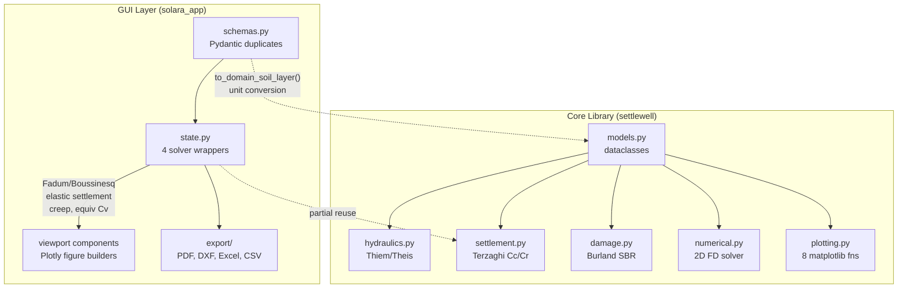
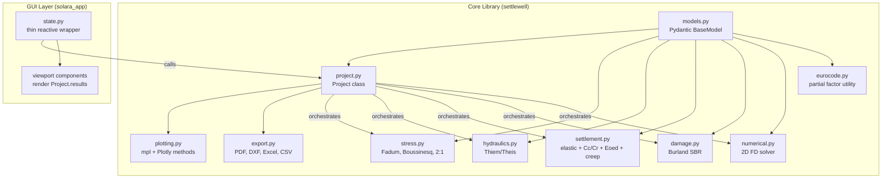

# Master Plan: Settlewell Project-Centric Architecture Refactoring

> **Goal**: Refactor `settlewell` from a flat, function-based architecture with duplicated GUI computation to a unified, `Project`-centric API powered by Pydantic models and a single computation engine.

---

## Design Decisions Registry

| # | Decision | Choice |
|---|---|---|
| 1 | Top-level orchestrator | `Project` class |
| 2 | Hierarchy | Named sub-objects (`.soil`, `.pit`, `.dewatering`, `.buildings`, `.loads`) + `.results` namespace |
| 3 | Computation trigger | Explicit `solve()` calls |
| 4 | Solve granularity | `solve()` + individual `solve_hydraulics()`, `solve_settlement()`, `solve_damage()` |
| 5 | Solver selection | Parameter on `solve()`: `hydraulics='analytical'\|'numerical'` |
| 6 | Results | Frozen Pydantic models: `HydraulicsResults`, `SettlementResults`, `DamageResults`, `ProjectResults` |
| 7 | Backward compat | Replace immediately — free functions become internal, full test rewrite |
| 8 | Plotting | Methods on `Project` — both matplotlib (static) and Plotly (interactive) |
| 9 | Serialization | Pydantic `model_dump_json()`/`model_validate_json()`, `.settlewell` extension |
| 10 | Validation | Eager per-field (`Field(gt=0)`) + cross-model on setter |
| 11 | Class type | Regular Python class (not Pydantic model itself, but owns Pydantic sub-objects) |
| 12 | Constructor | Both: kwargs in `__init__` + property setters with auto-invalidation |
| 13 | Module location | New `project.py` |
| 14 | Soil presets | `Project.from_template(...)` class method |
| 15 | State invalidation | Auto-invalidate results on input change |
| 16 | GUI solver transplant | **Full** — all 4 GUI solvers move to core library |
| 17 | Model framework | **Pydantic `BaseModel`** replaces all dataclasses |
| 18 | Pydantic dependency | Hard core dependency: `pydantic>=2.0` |
| 19 | GUI-only fields | Merge into unified models (id, color, uscs_type get defaults) |
| 20 | Unit convention | SI-only in model fields; GUI handles display conversion |
| 21 | Surface loads | First-class core concept: `LoadGeometry` model |
| 22 | Solver settings | Core `SolverSettings` model |
| 23 | Multi-scenario | GUI-only concern — `Project` = single analysis case |
| 24 | Eurocode 7 | Enum + `apply_partial_factors()` utility in core; not auto-applied in `solve()` |
| 25 | File format | `.settlewell` JSON via Pydantic serialization |
| 26 | Export engine | Move to core as optional feature (`project.export_pdf()` etc.) |
| 27 | Plotting frameworks | Keep both: matplotlib (static) + Plotly (interactive) |
| 28 | Plot unification | Both matplotlib and Plotly plots accessible via `Project.plot_*()` |
| 29 | Sprint ordering | Bottom-up: Models → Physics → Project → Tests → GUI → Export+Docs |
| 30 | Migration strategy | Incremental — each sprint leaves all tests green |
| 31 | Docs strategy | Update docs with each sprint, not deferred |

---

## Architecture: Before vs After

### Before (Current)



### After (Target)



---

## Sprint Overview

| Sprint | Focus | Key Deliverables | Entry Condition |
|--------|-------|-----------------|-----------------|
| **1** | Pydantic Model Migration | `models.py` → Pydantic `BaseModel`, merge GUI schema fields, add `LoadGeometry`, `SolverSettings` | None |
| **2** | Stress Distribution Physics | New `stress.py` module: Fadum, Boussinesq, 2:1, strip/rect/point stress | Sprint 1 green |
| **3** | Settlement & Consolidation Extension | Elastic settlement, secondary creep, equivalent Cv, `eurocode.py` utility | Sprint 2 green |
| **4** | Project Orchestrator | `project.py`: `Project` class, `solve_*()`, plotting, serialization | Sprint 3 green |
| **5** | Core Test Suite Rewrite | Migrate all 17 test files to `Project` API | Sprint 4 green |
| **6** | GUI Rewire | Replace GUI solvers with `Project`, simplify `state.py` and `schemas.py` | Sprint 5 green |
| **7** | Export + Docs + Polish | `export.py` in core, updated docs, notebooks, scripts, spec docs | Sprint 6 green |

---

## Sprint 1: Pydantic Model Migration

> **Goal**: Replace all `@dataclass` models with Pydantic `BaseModel`, merge GUI schema fields, add new model types.

### TDD Approach
Write new Pydantic model tests **first**, then migrate model code, then verify existing tests still pass.

### Deliverables

#### [MODIFY] [pyproject.toml](file:///d:/repos/bronbemaling/pyproject.toml)
- Add `pydantic>=2.0` to core `dependencies`
- Move `pydantic` out of `[web]` optional deps (already satisfied by core)

#### [MODIFY] [models.py](file:///d:/repos/bronbemaling/src/settlewell/models.py)
Migrate all 6 model classes from `@dataclass` to `BaseModel`:

**`SoilLayer`** — merged fields:
```python
class SoilLayer(BaseModel):
    model_config = ConfigDict(frozen=True)

    # Physics fields (SI units, required)
    name: str
    thickness: float = Field(gt=0, description="Layer thickness [m]")
    gamma: float = Field(gt=0, description="Dry unit weight [kN/m³]")
    gamma_sat: float = Field(gt=0, description="Saturated unit weight [kN/m³]")
    k_h: float = Field(gt=0, description="Horizontal hydraulic conductivity [m/s]")
    e0: float = Field(gt=0, description="Initial void ratio [-]")
    Cc: float = Field(ge=0, description="Compression index [-]")
    Cr: float = Field(ge=0, description="Recompression index [-]")
    Eoed: float = Field(gt=0, description="Oedometric modulus [kPa]")
    Cv: float = Field(ge=0, description="Consolidation coefficient [m²/s]")
    OCR: float = Field(ge=1.0, default=1.0, description="Overconsolidation ratio [-]")

    # Metadata fields (optional, for GUI/visualization)
    id: str | None = Field(default=None, description="Unique layer identifier")
    color: str = Field(default="#B0C4DE", description="Hex color for visualization")
    uscs_type: SoilTypeUSCS = Field(default=SoilTypeUSCS.SAND)
    flemish_type: FlemishSoilType | None = Field(default=None)

    # Cross-field validators
    @field_validator("gamma_sat")
    def validate_gamma_sat(cls, v, info): ...  # >= gamma

    @field_validator("Cr")
    def validate_cr(cls, v, info): ...  # <= Cc
```

**`SoilProfile`**, **`Well`**, **`ConstructionPit`**, **`DewateringConfig`**, **`Building`** — similar migration pattern. Each keeps its existing validation logic expressed via `Field()` constraints and `@field_validator`.

#### [NEW] New model types to add:

**`LoadGeometry`**:
```python
class LoadType(StrEnum):
    STRIP = "STRIP"
    RECTANGULAR = "RECTANGULAR"
    EMBANKMENT = "EMBANKMENT"
    POINT = "POINT"

class LoadGeometry(BaseModel):
    model_config = ConfigDict(frozen=True)
    id: str | None = Field(default=None)
    name: str = Field(default="Footing Load")
    type: LoadType = Field(default=LoadType.RECTANGULAR)
    x_center: float = Field(default=0.0, description="X coordinate [m]")
    z_surface_offset: float = Field(default=0.0, description="Depth offset [m]")
    width_B: float = Field(gt=0, default=4.0, description="Width B [m]")
    length_L: float = Field(gt=0, default=8.0, description="Length L [m]")
    stress_q: float = Field(gt=0, default=100.0, description="Applied stress q [kPa]")
```

**`SolverSettings`**:
```python
class StressMethod(StrEnum):
    BOUSSINESQ = "BOUSSINESQ"
    WESTERGAARD = "WESTERGAARD"
    TWO_TO_ONE = "2:1"

class DrainageType(StrEnum):
    DOUBLE = "DOUBLE"
    SINGLE = "SINGLE"

class SolverSettings(BaseModel):
    stress_method: StressMethod = Field(default=StressMethod.BOUSSINESQ)
    drainage: DrainageType = Field(default=DrainageType.DOUBLE)
    hydraulics_solver: str = Field(default="analytical")  # "analytical" | "numerical"
    settlement_method: str = Field(default="cc_cr")  # "cc_cr" | "eoed"
    z_max: float = Field(gt=0, default=20.0, description="Max calculation depth [m]")
    delta_z: float = Field(gt=0, default=0.25, description="Vertical mesh step [m]")
    grid_dx: float = Field(gt=0, default=1.0, description="Horizontal grid spacing [m]")
    grid_padding: float = Field(gt=0, default=50.0, description="Grid padding [m]")
    t_start_days: float = Field(ge=1.0, default=1.0)
    t_end_years: float = Field(gt=0, default=50.0)
    calculate_creep: bool = Field(default=False)
    time_s: float | None = Field(default=None, description="Pumping time [s] for Theis")
```

#### [MODIFY] [soils.py](file:///d:/repos/bronbemaling/src/settlewell/soils.py)
Move `SoilTypeUSCS` and `FlemishSoilType` to `models.py` (they're needed there now). Keep presets data here.

#### [MODIFY] [\_\_init\_\_.py](file:///d:/repos/bronbemaling/src/settlewell/__init__.py)
Add new exports: `LoadGeometry`, `LoadType`, `SolverSettings`, `StressMethod`, `DrainageType`, `SoilTypeUSCS`, `FlemishSoilType`.

#### Test files
- [NEW] `tests/test_pydantic_models.py` — Pydantic-specific behavior: `model_dump()`, `model_validate()`, frozen immutability, JSON roundtrip
- [MODIFY] `tests/test_models.py` — Existing validation tests should pass with minimal changes (Pydantic raises `ValidationError` instead of `ValueError`)
- [MODIFY] `tests/conftest.py` — Update fixtures if constructor signatures changed

#### Docs
- [MODIFY] `docs/api/models.md` — Update for new model types
- [MODIFY] `.agents/specs/hydraulics_and_models.md` — Update spec

#### Verification Gate
```bash
uv run pytest tests/test_models.py tests/test_pydantic_models.py -v
uv run --with ruff ruff check --fix . && uv run --with ruff ruff format .
```

---

## Sprint 2: Stress Distribution Physics

> **Goal**: Transplant Fadum, Boussinesq, and stress distribution functions from `state.py` into a new `stress.py` core module.

### TDD Approach
Write tests for stress functions against analytical solutions **first**, then extract and refactor code from `state.py`.

### Deliverables

#### [NEW] [stress.py](file:///d:/repos/bronbemaling/src/settlewell/stress.py)
New module containing:

```python
def fadum_corner_stress(b: float, l_dim: float, z: float) -> float:
    """Fadum (1948) corner stress influence for rectangular load."""

def compute_load_stress_increment(
    load: LoadGeometry, x_rel: float, z: float,
    method: StressMethod = StressMethod.BOUSSINESQ,
) -> float:
    """Vertical stress increment Δσ_z under a surface load at depth z."""

def compute_stress_profile_under_loads(
    loads: list[LoadGeometry],
    z_points: np.ndarray,
    x_eval: float = 0.0,
    method: StressMethod = StressMethod.BOUSSINESQ,
) -> np.ndarray:
    """1D stress increment profile under load center(s)."""

def compute_stress_heatmap(
    loads: list[LoadGeometry],
    z_points: np.ndarray,
    x_points: np.ndarray,
    method: StressMethod = StressMethod.BOUSSINESQ,
) -> np.ndarray:
    """2D stress ratio heatmap grid (z × x)."""
```

#### Test files
- [NEW] `tests/test_stress.py` — Fadum corner values vs published tables, Boussinesq point load, strip load vs Flamant solution, rectangular load symmetry

#### Docs
- [NEW] `docs/api/stress.md` — API reference for stress distribution

#### Verification Gate
```bash
uv run pytest tests/test_stress.py tests/test_models.py -v
```

---

## Sprint 3: Settlement & Consolidation Extension

> **Goal**: Add elastic settlement, secondary creep, equivalent Cv for layered strata, and Eurocode 7 partial factor utility.

### TDD Approach
Write tests for elastic settlement and creep against textbook examples **first**, then implement.

### Deliverables

#### [MODIFY] [settlement.py](file:///d:/repos/bronbemaling/src/settlewell/settlement.py)
Add new functions:

```python
def compute_elastic_settlement(
    profile: SoilProfile,
    loads: list[LoadGeometry],
    method: StressMethod = StressMethod.BOUSSINESQ,
) -> tuple[float, list[float]]:
    """Immediate elastic settlement s_e = Σ(Δσ·H/Eoed) per layer."""

def compute_secondary_creep(
    total_primary_settlement: float,
    time_years: np.ndarray,
    C_alpha_ratio: float = 0.05,
) -> np.ndarray:
    """Secondary creep settlement s_creep = s_primary * C_α/Cc * log10(t/t_p)."""

def compute_equivalent_cv(
    profile: SoilProfile,
) -> float:
    """Equivalent Cv for layered strata: Cv_eq = H²/(Σ(hi/√Cvi))²."""

def compute_full_consolidation_vs_time(
    profile: SoilProfile,
    loads: list[LoadGeometry],
    times_years: np.ndarray,
    drainage: DrainageType = DrainageType.DOUBLE,
    calculate_creep: bool = False,
    method: str = "cc_cr",
    stress_method: StressMethod = StressMethod.BOUSSINESQ,
) -> dict:
    """Full time-consolidation curve: elastic + primary + creep."""
```

#### [NEW] [eurocode.py](file:///d:/repos/bronbemaling/src/settlewell/eurocode.py)
```python
class DesignApproach(StrEnum):
    SLS_CHARACTERISTIC = "SLS_CHARACTERISTIC"
    EC7_DA1_M1 = "EC7_DA1_M1"
    EC7_DA1_M2 = "EC7_DA1_M2"

def apply_partial_factors(
    layer: SoilLayer,
    approach: DesignApproach,
) -> SoilLayer:
    """Apply Eurocode 7 partial safety factors to soil parameters."""
```

#### Test files
- [NEW] `tests/test_elastic_settlement.py` — elastic settlement vs manual calc, creep convergence
- [NEW] `tests/test_eurocode.py` — partial factor scaling verification
- [MODIFY] `tests/test_settlement.py` — verify existing tests still pass

#### Docs
- [NEW] `docs/api/eurocode.md`
- [MODIFY] `docs/api/settlement.md` — Add elastic/creep docs

#### Verification Gate
```bash
uv run pytest tests/test_settlement.py tests/test_elastic_settlement.py tests/test_eurocode.py tests/test_stress.py -v
```

---

## Sprint 4: Project Orchestrator

> **Goal**: Build the `Project` class that orchestrates all computation, plotting, and serialization.

### TDD Approach
Write `test_project.py` **first** with the target API, then implement `Project`.

### Deliverables

#### [NEW] [project.py](file:///d:/repos/bronbemaling/src/settlewell/project.py)
`Project` class with:
- Constructor: `Project(soil=, pit=, dewatering=, buildings=, loads=, settings=)`
- Properties with eager validation + auto-invalidation
- `solve()`, `solve_hydraulics()`, `solve_settlement()`, `solve_damage()`
- `plot_*()` methods (matplotlib + Plotly)
- `save()`, `load()`, `to_dict()`, `from_dict()`
- `Project.from_template()` class method

Frozen result models:
- `HydraulicsResults`, `SettlementResults`, `DamageResults`, `StressResults`, `ProjectResults`

#### [MODIFY] [\_\_init\_\_.py](file:///d:/repos/bronbemaling/src/settlewell/__init__.py)
- Add `Project` and result types to `__all__`
- Remove free functions from `__all__` (keep importable internally)

#### [MODIFY] [plotting.py](file:///d:/repos/bronbemaling/src/settlewell/plotting.py)
- Adapt existing functions to accept result objects instead of raw arrays where beneficial
- Add new Plotly-based plot functions for interactive views

#### Test files
- [NEW] `tests/test_project.py` — Full lifecycle: construct → validate → solve → results → plots → serialize → load → re-solve

#### Docs
- [NEW] `docs/api/project.md`
- [MODIFY] `docs/getting-started.md` — Rewrite quickstart with `Project` API
- [MODIFY] `mkdocs.yml` — Add project page to nav

#### Verification Gate
```bash
uv run pytest tests/test_project.py tests/test_stress.py tests/test_settlement.py tests/test_models.py -v
```

---

## Sprint 5: Core Test Suite Rewrite

> **Goal**: Migrate all existing test files from free-function calls to `Project`-based API.

### Strategy
For each test file:
1. Replace free-function imports with `Project` imports
2. Construct `Project` instances using existing fixture data
3. Call `project.solve_*()` instead of standalone functions
4. Assert on `project.results.*` fields
5. Verify numerical values are **identical** to pre-migration (same physics)

### Test file migration table

| Test File | Lines | Complexity | Notes |
|---|---|---|---|
| `test_models.py` | 500+ | Low | Mostly unchanged — model validation tests |
| `test_hydraulics.py` | 470+ | Medium | Replace `compute_*` calls with `project.solve_hydraulics()` |
| `test_settlement.py` | 500+ | Medium | Replace `compute_*` calls with `project.solve_settlement()` |
| `test_damage.py` | 300+ | Medium | Replace `assess_building_damage` with `project.solve_damage()` |
| `test_numerical.py` | 200+ | Medium | Replace `solve_steady_state` with `project.solve(hydraulics='numerical')` |
| `test_plotting.py` | 280+ | Low | Replace `plot_*()` with `project.plot_*()` |
| `test_physics_convergence.py` | 500+ | High | Multiple solver comparisons — careful migration |
| `test_flemish_soils.py` | 80+ | Low | Add `Project.from_template()` tests |
| `test_remediation_physics.py` | 180+ | Medium | Uses GUI solvers — must use new core solvers |
| `conftest.py` | 100+ | Low | Add `project` fixture |

#### Verification Gate
```bash
uv run pytest -v  # ALL tests must pass
uv run pytest -m 'not slow' -v  # Fast subset
```

---

## Sprint 6: GUI Rewire

> **Goal**: Replace GUI solver wrappers with `Project.solve_*()` calls. Simplify `state.py` and `schemas.py`.

### Strategy

#### [MODIFY] [schemas.py](file:///d:/repos/bronbemaling/src/settlewell/solara_app/schemas.py)
- **Delete** all duplicated model schemas (`SoilLayerSchema`, `WellSchema`, `BuildingSchema`, `ConstructionPitSchema`)
- **Delete** `to_domain_soil_layer()`, `from_domain_soil_layer()` conversion functions
- **Delete** duplicated enums (`AquiferType`, `BuildingType`, `LoadType`, `StressMethod`, `DrainageType`)
- **Keep** `ScenarioSchema` (GUI-only multi-scenario concept) but it now references core models
- **Keep** `ProjectState` (GUI reactive state) — holds `list[Project]` instead of `list[ScenarioSchema]`
- **Keep** `ProjectMetadataSchema` (GUI-only metadata)

```python
# After refactor — schemas.py is dramatically simpler
from settlewell import Project, SolverSettings

class ProjectState(BaseModel):
    version: str = "3.0"
    metadata: ProjectMetadataSchema = ...
    projects: list[dict] = []  # Serialized Project instances (scenarios)
    active_project_index: int = 0
    edit_mode: bool = True
    dark_mode: bool = False
```

#### [MODIFY] [state.py](file:///d:/repos/bronbemaling/src/settlewell/solara_app/state.py)
- **Delete** `run_fast_elastic_solve()` → replaced by `project.solve_settlement()` 
- **Delete** `run_full_consolidation_solve()` → replaced by `project.solve()` with creep
- **Delete** `run_hydraulics_solve()` → replaced by `project.solve_hydraulics()`
- **Delete** `run_building_damage_solve()` → replaced by `project.solve_damage()`
- **Delete** `_fadum_corner()`, `_compute_load_delta_sigma()` → now in `stress.py`
- **Simplify** CRUD helpers (add/update/delete layer/load/well/building) — operate on `Project` properties
- **Simplify** `save_project_json()` / `load_project_json()` → delegate to `Project.save()` / `Project.load()`

#### [MODIFY] Viewport components
- Replace `run_*_solve(scenario)` calls with accessing `Project.results`
- Remove inline Plotly figure builders where `Project.plot_*()` provides equivalent
- Keep custom Plotly builders for GUI-specific visualizations (subsoil canvas, scenario comparison)

#### Test files
- [MODIFY] `tests/test_solara_state.py`
- [MODIFY] `tests/test_e2e_solara_app.py`
- [MODIFY] `tests/test_dewatering_damage_components.py`
- [MODIFY] `tests/test_drawer_components.py`
- [MODIFY] `tests/test_viewport_components.py`
- [MODIFY] `tests/test_subsoil_canvas.py`

#### Verification Gate
```bash
uv run pytest -v  # ALL tests including GUI tests
```

---

## Sprint 7: Export + Docs + Polish

> **Goal**: Move export engine to core, update all docs/notebooks/scripts, final cleanup.

### Deliverables

#### [NEW] [export.py](file:///d:/repos/bronbemaling/src/settlewell/export.py)
Move from `solara_app/export/` to core. Add methods to `Project`:
```python
class Project:
    def export_pdf(self, path: str) -> None: ...    # requires reportlab
    def export_dxf(self, path: str) -> None: ...    # requires ezdxf
    def export_excel(self, path: str) -> None: ...   # requires openpyxl
    def export_csv(self, path: str) -> None: ...     # stdlib
```

#### [MODIFY] [pyproject.toml](file:///d:/repos/bronbemaling/pyproject.toml)
Add `[project.optional-dependencies]`:
```toml
export = [
    "reportlab>=5.0.0",
    "ezdxf>=1.4.4",
    "openpyxl>=3.1.5",
]
```

#### Docs
- [MODIFY] All `docs/api/*.md` — Final API reference pass
- [MODIFY] `docs/getting-started.md` — Complete rewrite with `Project` workflow
- [MODIFY] `docs/theory.md` — Add stress distribution theory
- [NEW] `docs/api/project.md`, `docs/api/stress.md`, `docs/api/eurocode.md`, `docs/api/export.md`
- [MODIFY] `mkdocs.yml` — Updated nav

#### Notebooks
- [MODIFY] `notebooks/example_analysis.ipynb` — Rewrite with `Project` API
- [MODIFY] `notebooks/kauwereelstraat_31_analysis.ipynb` — Rewrite case study

#### Scripts
- [MODIFY] `scripts/generate_docs_plots.py` — Use `Project` API
- [MODIFY] `scripts/generate_kauwereelstraat_notebook.py` — Use `Project` API

#### Agent specs
- [MODIFY] `.agents/README.md` — Update version history
- [MODIFY] `.agents/specs/architecture.md` — Update package structure, dependencies
- [MODIFY] `.agents/specs/hydraulics_and_models.md` — Update for Pydantic models

#### Cleanup
- Delete dead code: unused conversion functions, duplicated enums
- Final `ruff check --fix` and `ruff format`
- Version bump to `0.2.0`

#### Verification Gate
```bash
uv run pytest -v
uv run --with ruff ruff check --fix . && uv run --with ruff ruff format .
uv run --extra docs mkdocs build  # zero warnings
```

---

## Target API (End State)

```python
import settlewell as sw

# Create project
project = sw.Project(
    soil=sw.SoilProfile(
        layers=[
            sw.SoilLayer(name="Sand", thickness=3.0, gamma=17.5, gamma_sat=19.5,
                         k_h=1e-4, e0=0.65, Cc=0.05, Cr=0.01, Eoed=25000, Cv=15e-7),
            sw.SoilLayer(name="Clay", thickness=6.5, gamma=15.0, gamma_sat=17.0,
                         k_h=1e-9, e0=1.10, Cc=0.35, Cr=0.06, Eoed=8000, Cv=5e-8, OCR=3.0),
        ],
        gwl_mtaw=5.0, surface_level_mtaw=7.0,
    ),
    pit=sw.ConstructionPit(length=20, width=15, depth=3.5),
    dewatering=sw.DewateringConfig(
        wells=[sw.Well(x=5, y=0, Q=0.005), sw.Well(x=-5, y=0, Q=0.005)],
        target_drawdown_mtaw=1.5, original_gwl_mtaw=5.0, pumping_duration_days=90,
    ),
    loads=[sw.LoadGeometry(name="Footing", width_B=4, length_L=8, stress_q=120)],
    buildings=[sw.Building(x=30, y=0, length=12, width=8)],
    settings=sw.SolverSettings(
        stress_method=sw.StressMethod.BOUSSINESQ,
        drainage=sw.DrainageType.DOUBLE,
        calculate_creep=True,
    ),
)

# Or from Flemish template
project = sw.Project.from_template("Antwerp Boom Clay Formation", gwl_mtaw=5.0, surface_level_mtaw=7.0)

# Solve
project.solve()

# Inspect results
project.results.hydraulics.T          # Transmissivity [m²/s]
project.results.hydraulics.R          # Radius of influence [m]
project.results.stress.delta_sigma_z  # Stress increment profile
project.results.settlement.elastic_settlement_mm
project.results.settlement.primary_settlement_mm
project.results.settlement.creep_settlement_mm
project.results.damage.assessments[0].damage_category

# Plot
project.plot_plan_view()              # matplotlib
project.plot_plan_view(engine="plotly")  # Plotly interactive
project.plot_cross_section()
project.plot_3d_drawdown()
project.plot_time_settlement()

# Export
project.export_pdf("report.pdf")
project.export_excel("data.xlsx")

# Serialize
project.save("project.settlewell")
loaded = sw.Project.load("project.settlewell")

# Eurocode 7 (explicit, not automatic)
scaled_layer = sw.apply_partial_factors(project.soil.layers[0], sw.DesignApproach.EC7_DA1_M2)
```

---

## Risk Register

| Risk | Mitigation |
|------|-----------|
| Pydantic `BaseModel` breaks test assertions (e.g., `ValidationError` vs `ValueError`) | Sprint 1 explicitly handles error type migration in tests |
| Frozen Pydantic models break GUI reactivity (can't mutate in-place) | GUI uses `model_copy(update={...})` pattern; `Project` setters handle auto-invalidation |
| Numerical results drift after physics transplant | Sprint 5 compares pre/post numerical values with `np.allclose()` |
| Large scope causes sprint overruns | Fine-grained 7-sprint plan allows pausing at any green checkpoint |
| Export optional deps not installed | Guard imports with `try/except`, raise `ImportError` with install instructions |

---

## Sub-Plan References

Each sprint will get its own detailed implementation plan document before execution:

| Document | Sprint | Path |
|----------|--------|------|
| Sprint 1 Plan | Pydantic Models | `.agents/refactoring/sprint1_plan.md` |
| Sprint 2 Plan | Stress Physics | `.agents/refactoring/sprint2_plan.md` |
| Sprint 3 Plan | Settlement Extension | `.agents/refactoring/sprint3_plan.md` |
| Sprint 4 Plan | Project Class | `.agents/refactoring/sprint4_plan.md` |
| Sprint 5 Plan | Test Rewrite | `.agents/refactoring/sprint5_plan.md` |
| Sprint 6 Plan | GUI Rewire | `.agents/refactoring/sprint6_plan.md` |
| Sprint 7 Plan | Export + Docs | `.agents/refactoring/sprint7_plan.md` |

Each sub-plan will contain:
- Exact function signatures with type annotations
- Step-by-step TDD test cases (test first, then implement)
- File-by-file change list with line ranges
- Mathematical formulas for physics functions
- Verification commands
