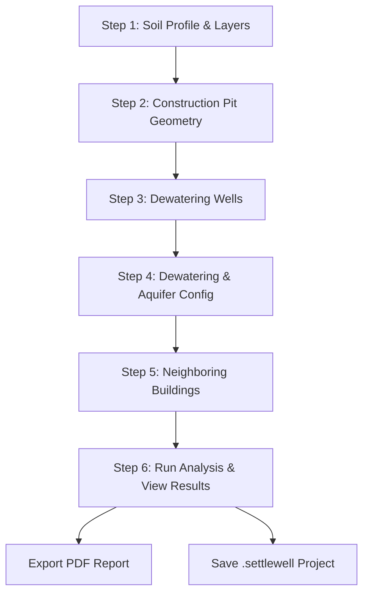

# Desktop GUI Guide

`settlewell` includes a standalone, dark-themed **PySide6 desktop application** (`settlewell-gui`) designed to guide geotechnical engineers through ground settlement and dewatering risk analysis.

---

## Installation & Launch

To use the desktop application, install `settlewell` with the `gui` optional dependency group:

```bash
# Install package with GUI extra
uv sync --extra gui

# Launch the desktop GUI executable
uv run settlewell-gui
```

Alternatively, you can launch the application via Python module execution:

```bash
uv run python -m settlewell.gui
```

---

## Interactive 6-Step Wizard Workflow

The desktop application uses an interactive step-by-step wizard (`QWizard`) to collect inputs, perform background computations, and render result charts.



### Step 1: Bodemprofiel & Grondlagen (Soil Profile)
- **Surface & Groundwater Levels**: Specify surface elevation (mTAW) and initial ground water level (GWL in mTAW).
- **Soil Layer Table (`SoilLayerTable`)**: Add, edit, or remove soil layers with 11 geotechnical parameters:
  - `Naam`: Layer description (e.g., *Sand*, *Clay*, *Peat*)
  - `Dikte [m]`: Layer thickness
  - `γ [kN/m³]`: Moist unit weight above water table
  - `γ_sat [kN/m³]`: Saturated unit weight below water table
  - `k_h [m/s]`: Horizontal hydraulic conductivity
  - `e₀ [-]`: Initial void ratio
  - `Cc [-]`: Primary compression index
  - `Cr [-]`: Recompression index
  - `E_oed [kPa]`: Oedometer stiffness modulus
  - `Cv [m²/s]`: Coefficient of consolidation
  - `OCR [-]`: Overconsolidation ratio

### Step 2: Bouwput Geometrie (Construction Pit)
- Define excavation dimensions:
  - `Length [m]` and `Width [m]`
  - `Excavation Depth [m]`
  - `Center Coordinates (X, Y)` [m]
  - `Pit Bottom Elevation` [mTAW]

### Step 3: Bemalingsfilters (Dewatering Wells)
- Tabular configuration of extraction wells (`WellTable`):
  - Well position coordinates $(X, Y)$
  - Pumping rate $Q$ [m³/s]
  - Casing radius $r_w$ [m]
  - Filter screen top and bottom elevations [mTAW]
- Default configuration pre-populates 4 extraction wells at the pit corners.

### Step 4: Systeem & Aquifer Instellingen (Dewatering Config)
- Target drawdown level [mTAW] and pumping duration [days].
- Aquifer type selection (`UNCONFINED` vs. `CONFINED`).
- Optional override inputs for Transmissivity $T$ [m²/s], Storativity $S$ [-], and Radius of Influence $R$ [m].
- Target drawdown and initial GWL auto-populate automatically from Steps 1 and 2.

### Step 5: Naburige Bebouwing (Neighboring Buildings)
- Tabular configuration of neighboring structures (`BuildingTable`):
  - Building coordinates $(X, Y)$, length, width, and orientation [°].
  - Foundation depth below ground level [m].
  - Structural construction type selector (`MASONRY` vs `CONCRETE_FRAME`).

### Step 6: Resultaten & Analyse (Results Page)
- Click **Analyse Uitvoeren** to trigger the calculation pipeline.
- Progress bar displays real-time execution status as calculations run in a background thread (`QThread`).
- Results are organized across **7 interactive tabs**:
  1. **Dwarsdoorsnede**: Geotechnical cross-section plot showing soil stratigraphy, initial GWL, and drawdown cone.
  2. **Grondplan**: 2D plan view of construction pit, extraction wells, contour lines, and neighboring buildings.
  3. **Zettingskom**: Settlement trough profile along evaluation transects.
  4. **Tijd-Zetting**: Time-dependent consolidation settlement curve over the pumping duration.
  5. **Spanningsverloop**: Effective stress profile vs. depth ($\sigma'_{v0}$ vs $\sigma'_{v,final}$).
  6. **3D Bemalingskegel**: 3D surface plot of drawdown cone across the evaluation grid.
  7. **Schadesamenvatting**: Structural damage risk summary table (Burland & Wroth / SBR criteria).

---

## File Management & Export

### Project Files (`.settlewell`)
Save and restore complete analysis states using standard JSON project files:
- **File > Opslaan (Save)** (`Ctrl+S`): Save project inputs.
- **File > Open Project...** (`Ctrl+O`): Open an existing `.settlewell` project file.
- **File > Nieuw Project** (`Ctrl+N`): Reset to a new project session.

### PDF Report Export
- **File > Exporteer PDF Rapport...**: Consolidates all 7 interactive result figures into a single multi-page PDF document using Matplotlib's `PdfPages` backend.

---

## Input Validation Rules

The wizard dynamically enforces physical and geotechnical constraints before enabling the **Volgende >** button:
- Ground Water Level (GWL) must be at or below the surface elevation.
- Layer thicknesses, stiffness moduli, unit weights, and conductivities must be strictly positive ($> 0$).
- Saturated unit weight must meet $\gamma_{\text{sat}} \ge \gamma$.
- Overconsolidation ratio must meet $\text{OCR} \ge 1.0$.
- Recompression index must meet $C_r \le C_c$.
- Dewatering well screen top elevation must be higher than screen bottom elevation.
