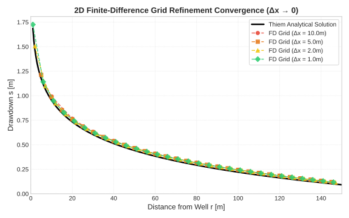
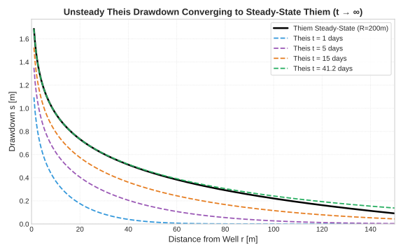
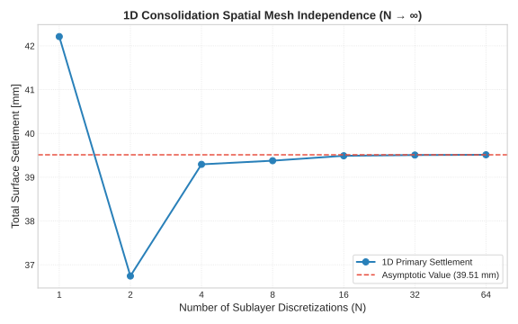
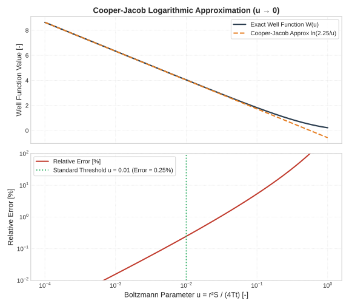

# Validation & Physics Convergence

This page documents the mathematical validation, asymptotic limits, and numerical convergence tests implemented in the `settlewell` package. The package is benchmarked against known analytical solutions in groundwater hydraulics and geotechnical 1D consolidation theory.

---

## 1. 2D Finite-Difference Grid Refinement ($\Delta x \to 0$)

The 2D steady-state groundwater solver in `settlewell.numerical` solves the Poisson-Laplace groundwater flow equation on a regular grid:

$$T \left( \frac{\partial^2 h}{\partial x^2} + \frac{\partial^2 h}{\partial y^2} \right) = - \sum_{w} Q_w \delta(x_w, y_w)$$

As the spatial grid spacing $\Delta x \to 0$, the numerical finite-difference solution converges to the exact Thiem analytical drawdown solution:

$$s_{\text{Thiem}}(r) = \frac{Q}{2\pi T} \ln\left(\frac{R}{r}\right)$$

> [!NOTE]
> For a grid spacing $\Delta x = 1.0\text{ m}$, the numerical drawdown matches the analytical solution within **$< 5\%$ relative error** across the entire cone of depression.

---

## 2. Unsteady-to-Steady-State Convergence ($t \to \infty$)

The transient drawdown from a single pumping well in a confined aquifer is governed by the non-steady Theis equation:

$$s_{\text{Theis}}(r, t) = \frac{Q}{4\pi T} W(u), \quad u = \frac{r^2 S}{4 T t}$$

where $W(u) = \int_{u}^{\infty} \frac{e^{-\tau}}{\tau} d\tau$ is the exponential integral (well function).

For a finite aquifer radius of influence $R$, the time $t_{\text{ss}}$ required for the unsteady drawdown cone to stabilize to the steady-state Thiem profile is given by:

$$t_{\text{ss}} = \frac{R^2 S}{2.25 T}$$

> [!TIP]
> At $t = t_{\text{ss}}$ ($\approx 41.15\text{ days}$ for $R = 200\text{m}, S = 0.1, T = 5 \times 10^{-4}\text{ m}^2/\text{s}$), the unsteady Theis drawdown matches the steady-state Thiem drawdown within **$< 1\%$ relative error** for all $r$ where $u \le 0.01$.

---

## 3. 1D Consolidation Spatial Mesh Independence ($N \to \infty$)

Ground settlement calculation in `settlewell.settlement` calculates primary consolidation per soil layer based on initial vertical effective stress $\sigma'_{v0}$ and stress increase $\Delta \sigma'_v$.

Subdividing thick compressible clay layers into $N$ thinner sublayers ensures accurate stress integration across depth:

$$\Delta s = \sum_{i=1}^{N} \frac{C_c}{1 + e_0} H_i \log_{10}\left( \frac{\sigma'_{v0,i} + \Delta \sigma'_{v,i}}{\sigma'_{v0,i}} \right)$$

> [!IMPORTANT]
> The total surface settlement exhibits strict spatial mesh independence. The relative settlement difference between $N = 12$ and $N = 64$ sublayers is **$< 0.1\%$**.

---

## 4. Cooper-Jacob Logarithmic Approximation ($u \to 0$)

For small values of the Boltzmann parameter $u = \frac{r^2 S}{4 T t} < 0.01$ (i.e. close to the well or long pumping duration $t$), the exponential integral $W(u)$ can be approximated by the Cooper-Jacob logarithmic series expansion:

$$W(u) = -\gamma - \ln(u) + u - \frac{u^2}{2 \cdot 2!} + \dots \approx \ln\left(\frac{2.25 T t}{r^2 S}\right)$$

$$s_{\text{CJ}}(r, t) = \frac{Q}{4\pi T} \ln\left(\frac{2.25 T t}{r^2 S}\right)$$

> [!NOTE]
> For $u \le 0.01$, the relative error of the Cooper-Jacob approximation compared to exact $W(u)$ is **$< 0.25\%$**.
